# 参考：

https://windmt.com/tags/RabbitMQ/

http://cmsblogs.com/?s=rabbitmq

http://www.iocoder.cn/Spring-Boot/RabbitMQ/

http://www.iocoder.cn/RabbitMQ/install/?vip

[RabbitMQ（零）：基础概念](https://windmt.com/2018/04/12/rabbitmq-0-introduction/)

[TOC]

# 1、基础概念

`RabbitMQ` 是以 `AMQP` 协议实现的一种中间件产品，服务器端用 `Erlang` 语言编写，它可以支持多种操作系统，多种编程语言，几乎可以覆盖所有主流的企业级技术平台。

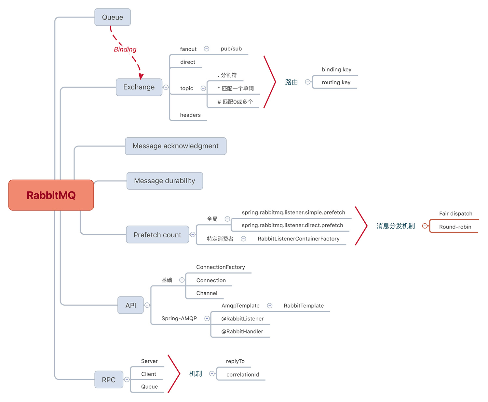

## 1.1、消息队列MQ

MQ全称为`Message Queue`，消息队列是应用程序和应用程序之间的通讯方法。

- **为什么用MQ**

  在项目中，可**将一些无需即时返回且耗时的操作提取出来，进行异步处理，而这种异步处理的方式大大的节省了服务器的请求响应时间，从而提高了系统的吞吐量(`请求线程及时释放了`)和用户体验性**。

- 开发中消息队列通常有如下应用场景：

  1. 任务异步处理

     将不需要同步处理的并且耗时长的操作由消息队列通知消息接收方进行异步处理。提高了应用程序的响应时间。

  2. 应用程序解耦合

     MQ相当于一个中介，生产方通过MQ与消费方交互，他将应用程序进行解耦。

## 1.2、AMQP、JMS、Message Broken

### 1.2.1、Message Broker

**`Message Broker` 是一种消息验证、传输、路由的架构模式**，其设计目标主要应用于下面这些场景：

-  消息路由到一个或多个目的地
- 消息转化为其他的表现方式
- 执行消息的聚集、消息的分解，并将结果发送到他们的目的地，然后重新组合相应返回给消息用户
- 调用 Web 服务来检索数据
- 响应事件或错误
- 使用发布 - 订阅模式来提供内容或基于主题的消息路由

### 1.2.2、JMS

`JMS` 即java消息服务（`JavaMessage Service`）应用程序接口，**是一个java平台中关于面向java消息中间件（`MOM`）的API，用于在两个应用程序之间，或分布式系统中发布消息，进行异步通信**。

### 1.2.3、AMQP

AMQP 是 `Advanced Message Queuing Protocol` 的简称，它是**一个面向消息中间件的开放式标准应用层协议**。**`AMQP`不从API层进行限定，而是直接定义网络交换的数据格式**。AMQP 定义了这些特性：

- 消息方向
- 消息队列
- 消息路由（包括：点到点和发布 - 订阅模式）
- 可靠性
- 安全性

### 1.2.3.4、AMQP 与 JMS 区别

- `JMS`是定义了统一的接口，来对消息操作进行统一；`AMQP`是通过规定协议来统一数据交互的格式。
- `JMS`限定了必须使用Java语言；`AMQP`只是协议，不规定实现方式，因此是跨语言的。
- `JMS`限定了两种消息模式；而`AMQP`的消息模式更加丰富。

## 1.3、ConnectionFactory、Connection、Channel

`ConnectionFactory`、`Connection`、`Channel`都是RabbitMQ对外提供的API中最基本的对象。

- `ConnectionFactory`为 `Connection`的制造工厂。
- `Connection`是RabbitMQ的 `Socket`链接，它封装了socket 协议相关部分逻辑。
- `Channel` 是我们与RabbitMQ 打交道的最重要的一个接口，我们大部分的业务操作是在 `Channel`这个接口中完成的，包括定义`Queue`、定义`Exchange`、绑定 `Queue`与 `Exchange`、发布消息等。

## 1.4、Queue 队列

`Queue`（队列）是RabbitMQ的内部对象，用于存储消息。

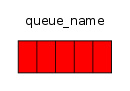

RabbitMQ 中的消息都只能存储在 Queue 中，生产者（下图中的 P）生产消息并最终投递到 Queue 中，消费者（下图中的 C）可以从 Queue 中获取消息并消费。
[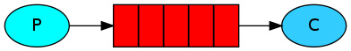](https://src.windmt.com/img/006tNc79ly1fq9t95xao1j30aw01mdfo.jpg)
多个消费者可以订阅同一个 Queue，**这时 Queue 中的消息会被平均分摊给多个消费者进行处理，而不是每个消费者都收到所有的消息并处理。**
[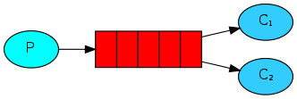](https://src.windmt.com/img/006tNc79ly1fq9tchttwrj3098033746.jpg)

## 1.5、Message acknowledgement 消息回执

在实际应用中，**可能会发生消费者收到 `Queue` 中的消息，但没有处理完成就宕机（或出现其他意外）的情况**，这种情况下就可能会导致消息丢失。

> 为了避免这种情况发生，我们可以**要求消费者在消费完消息后发送一个回执给 RabbitMQ，RabbitMQ 收到消息回执（`Message acknowledgment`）后才将该消息从 Queue 中移除**；如果 `RabbitMQ` **没有收到回执并检测到消费者的 RabbitMQ 连接断开，则 RabbitMQ 会将该消息发送给其他消费者（如果存在多个消费者）进行处理**。

这里不存在 `timeout` 概念，**一个消费者处理消息时间再长也不会导致该消息被发送给其他消费者，除非它的 RabbitMQ 连接断开。**

这里会产生另外一个问题，如果我们**在处理完业务逻辑后，忘记发送回执给 `RabbitMQ`**，这是个常见的低级错误，但是后果却是很严重的 ——Queue 中堆积的消息会越来越多，消费者重启后会重复消费这些消息并重复执行业务逻辑，周而复始。

> Spring AMQP 通过默认配置避免了忘记 basicACK 这种情况，所以我们并不需要特别关注。

**另外，pub message 是没有 ack 的。**

## 1.6、Message durability 消息持久

如果我们**希望即使在 `RabbitMQ` 服务重启的情况下，也不会丢失消息，我们可以将 `Queue` 与 `Message` 都设置为可持久化的（durable）**，这样可以保证绝大部分情况下我们的 RabbitMQ 消息不会丢失。

> 请注意，**这并不能完全保证就一定丢不了消息，因为 `RabbitMQ` 不会为每条消息执行 `fsync(2)`，它可能只是保存到缓存中，并没有真正写入磁盘**。如果我们需要对这种小概率事件（比如 RabbitMQ 服务器已经接收到生产者的消息，但还没来得及持久化该消息时 RabbitMQ 服务器就断电了）也要管理起来，那么我们**要用到事务**。

Spring AMQP 通过在 `MessageProperties` 中设置了合理默认值来定义消息的持久性。

| 属性         | 默认值     | 描述                                                        |
| :----------- | :--------- | :---------------------------------------------------------- |
| durable      | true       | 当 declareExchange 为 true 时，持久化标志被设置为该值       |
| deliveryMode | PERSISTENT | PERSISTENT 或 NON_PERSISTENT 来确定 RabbitMQ 是否持久化消息 |

## 1.7、Prefetch Count 预读取数

默认情况下，**如果有多个消费者同时订阅同一个 Queue 中的消息，Queue 中的消息会被平摊给多个消费者。平均而言，每个消费者将获得相同数量的消息**。这种分配消息的方式称为**循环调度**（`Round-robin`）。

这时**如果每个消息的处理时间不同，就有可能会导致某些消费者一直在忙，而另外一些消费者很快就处理完手头工作并一直空闲的情况**。

> 我们可以通过设置 `prefetchCount` 来限制 `Queue` 每次发送给每个消费者的消息数，比如我们设置 `prefetchCount=1`，则 **Queue 每次给每个消费者发送一条消息；消费者处理完这条消息后 `Queue` 会再给该消费者发送一条消息。**

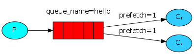

## 1.8、Exchange 交换器

之前我们看到**生产者将消息投递到 `Queue` 中，实际上这在 `RabbitMQ` 中这种事情永远都不会发生**。实际的情况是，**生产者将消息发送到 `Exchange`（交换器，下图中的 X），由 `Exchange` 将消息路由到一个或多个 Queue 中（或者丢弃）**。

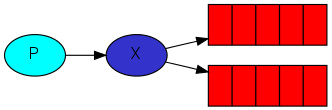

> RabbitMQ 中的 Exchange 有四种类型，不同的类型有着不同的路由策略。fanout、direct、topic、header。

## 1.9、Routing Key 路由ID

**生产者在将消息发送给 `Exchange` 的时候，一般会指定一个 `routing key`，来指定这个消息的路由规则，而这个 `routing key` 需要与 `Exchange Type` 及 `binding key` 联合使用才能最终生效**。在 `Exchange Type` 与 `binding key` 固定的情况下（在正常使用时一般这些内容都是固定配置好的），我们的生产者就可以在发送消息给 `Exchange` 时，通过指定 `routing key` 来决定消息流向哪里。RabbitMQ 为 `routing key` 设定的长度限制为 `255 bytes`。


## 1.10、Binding key 绑定ID

在绑定（`Binding`）`Exchange` 与 `Queue` 的同时，一般会指定一个 `binding key`；**消费者将消息发送给 `Exchange` 时，一般会指定一个 `routing key`；当 `binding key` 与 `routing key` 相匹配时，消息将会被路由到对应的 `Queue` 中。**

**在绑定多个 `Queue` 到同一个 `Exchange` 的时候，这些 `Binding` 允许使用相同的 `binding key`**。`binding key` 并不是在所有情况下都生效，它依赖于 `Exchange Type`，比如 **`fanout` 类型的 `Exchange` 就会无视 `binding key`，而是将消息路由到所有绑定到该 `Exchange` 的 `Queue`**。

## 1.11、Exchange Types 交换器类型

### 1.11.1、fanout

`fanout` 类型的 `Exchange` 路由规则非常简单，它会把所有发送到该 `Exchange` 的消息路由到所有与它绑定的 Queue 中。

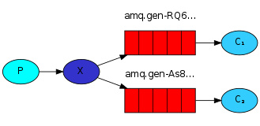

> 上图中，生产者（P）发送到 Exchange（X）的所有消息都会路由到图中的两个 Queue，并最终被两个消费者（C1 与 C2）消费。

### 1.11.2、direct

`direct`类型的 `Exchange`路由规则很简单，它会把消息路由到那些 `binding key` 与 `routing key`完全匹配的 `Queue` 中。 

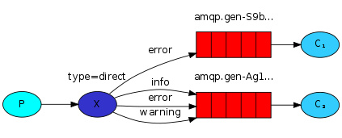

> 以上图的配置为例，我们以 routingKey=”error” 发送消息到 Exchange，则消息会路由到 Queue1（amqp.gen-S9b…，这是由 RabbitMQ 自动生成的 Queue 名称）和 Queue2（amqp.gen-Agl…）；如果我们以 routingKey=”info” 或 routingKey=”warning” 来发送消息，则消息只会路由到 Queue2。如果我们以其他 routingKey 发送消息，则消息不会路由到这两个 Queue 中。

### 1.11.3、Topic

前面讲到`direct`类型的`Exchange` 路由规则是完全匹配 `binding key` 与 `routing key`，但是这种严格的匹配方式在很多情况下不能满足实际业务需求。`topic` 类型的 `Exchange`在匹配规则上进行了扩展，它与 `direct` 类型的 `Exchange` 相似，也是将消息路由到 `binding key` 与 `routing key` 相匹配的 `Queue` 中，但这里的匹配规则有些不同，它约定：

- routing key 为一个句点号`.` 分隔的字符串（我们将被句点号`.` 分隔开的每一段独立的字符串称为一个单词），如 “stock.usd.nyse”、”nyse.vmw”、”quick.orange.rabbit”
- binding key 与 routing key 一样也是句点号`.` 分隔的字符串
- binding key 与 routing key 一样也是句点号`.` 分隔的字符串
- binding key 中可以存在两种特殊字符 `*` 与`#`，用于做模糊匹配，其中 `*` 用于匹配一个单词，`#`用于匹配多个单词（可以是零个）


以上图中的配置为例:
`routingKey=”quick.orange.rabbit”` 的消息会同时路由到 Q1 与 Q2
`routingKey=”lazy.orange.fox”` 的消息会路由到 Q1 与 Q2
`routingKey=”lazy.brown.fox”` 的消息会路由到 Q2
`routingKey=”lazy.pink.rabbit”` 的消息会路由到 Q2（只会投递给 Q2 一次，虽然这个 routingKey 与 Q2 的两个 bindingKey 都匹配）
`routingKey=”quick.brown.fox”、routingKey=”orange”、routingKey=”quick.orange.male.rabbit”` 的消息将会被丢弃，因为它们没有匹配任何 bindingKey

### 1.11.4、headers

eaders 类型的 Exchange 不依赖于 routing key 与 binding key 的匹配规则来路由消息，而是根据发送的消息内容中的 headers 属性进行匹配。在绑定 Queue 与 Exchange 时指定一组键值对；当消息发送到 Exchange 时，RabbitMQ 会取到该消息的 headers（也是一个键值对的形式），对比其中的键值对是否完全匹配 Queue 与 Exchange 绑定时指定的键值对；如果完全匹配则消息会路由到该 Queue，否则不会路由到该 Queue。该类型的 Exchange 没有用到过（不过也应该很有用武之地），所以不做介绍。

### 1.11.5、RPC

MQ 本身是基于异步的消息处理，前面的示例中所有的生产者（P）将消息发送到 RabbitMQ 后不会知道消费者（C）处理成功或者失败（甚至连有没有消费者来处理这条消息都不知道）。但实际的应用场景中，我们很可能需要**一些同步处理，需要同步等待服务端将我的消息处理完成后再进行下一步处理。这相当于 RPC**（Remote Procedure Call，远程过程调用）。在 RabbitMQ 中也支持 RPC。

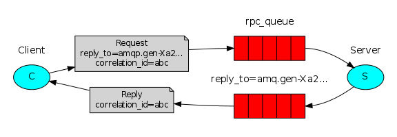

**RabbitMQ 中实现 RPC 的机制是：**

- 客户端发送请求（消息）时，在消息的属性（`MessageProperties`，在 `AMQP` 协议中定义了 14 种 `properties`，这些属性会随着消息一起发送）中设置两个值 `replyTo`（一个 `Queue` 名称，用于告诉服务器处理完成后将通知我的消息发送到这个 `Queue` 中）和 `correlationId`（此次请求的标识号，服务器处理完成后需要将此属性返还，客户端将根据这个 id 了解哪条请求被成功执行了或执行失败）
- 服务器端收到消息并处理
- 服务器端处理完消息后，将生成一条应答消息到 `replyTo` 指定的 `Queue`，同时带上 `correlationId` 属性
- 客户端之前已订阅 `replyTo` 指定的 `Queue`，从中收到服务器的应答消息后，根据其中的 `correlationId` 属性分析哪条请求被执行了，根据执行结果进行后续业务处理

# 2、RabbitMQ入门：Hello World

## 2.1、前言

**先决条件**
✔️ 正确安装 RabbitMQ 并将其运行在 localhost:5672 上

具体部署可查看该`blog`

http://www.iocoder.cn/RabbitMQ/install/?vip

## 2.2、JavaSE 方式

 应用整合 RabbitMQ，并实现一个简单的发送、接收消息的例子来对 RabbitMQ 有一个直观的感受和理解。

[](https://src.windmt.com/img/006tNc79ly1fq9t95xao1j30aw01mdfo.jpg)

在 [`pom.xml`](https://github.com/YunaiV/SpringBoot-Labs/blob/master/lab-04/lab-04-rabbitmq-native/pom.xml) 文件中，引入相关依赖。

```xml
<?xml version="1.0" encoding="UTF-8"?>
<project xmlns="http://maven.apache.org/POM/4.0.0"
         xmlns:xsi="http://www.w3.org/2001/XMLSchema-instance"
         xsi:schemaLocation="http://maven.apache.org/POM/4.0.0 http://maven.apache.org/xsd/maven-4.0.0.xsd">
    <parent>
        <artifactId>lab-04</artifactId>
        <groupId>cn.iocoder.springboot.labs</groupId>
        <version>1.0-SNAPSHOT</version>
    </parent>
    <modelVersion>4.0.0</modelVersion>

    <artifactId>lab-04-rabbitmq-native</artifactId>

    <dependencies>
        <!-- 引入 RabbitMQ 客户端依赖 -->
        <dependency>
            <groupId>com.rabbitmq</groupId>
            <artifactId>amqp-client</artifactId>
            <version>5.7.3</version>
        </dependency>
    </dependencies>

</project>
```

**RabbitMQProducer 生产端**

创建 [RabbitMQProducer](https://github.com/YunaiV/SpringBoot-Labs/blob/master/lab-04/lab-04-rabbitmq-native/src/main/java/cn/iocoder/springboot/lab04/rabbitmqdemo/RabbitMQProducer.java) 类，使用 [Channel](https://github.com/rabbitmq/rabbitmq-java-client/blob/master/src/main/java/com/rabbitmq/client/Channel.java) 发送消息。代码如下：

```java
/**
 * rabbitmq生产者
 * Hello world!
 *
 * @author Administrator
 */
public class RabbitMqProducer {

    private static final String IP_ADDRESS = "127.0.0.1";

    private static final Integer PORT = 5672;

    private static final String USERNAME = "guest";

    private static final String PASSWORD = "guest";

    private static final String EXCHANGE_NAME = "exchange_demo";

    private static final String ROUTING_KEY = "routingkey_demo";

    /**
     * 只有 QUEUE_NAME 需要共享给 RabbitMQConsumer
     */
    private static final String QUEUE_NAME = "queue_demo";

    public static void main( String[] args ) throws IOException, TimeoutException {
        // 建立rabbitmiq连接
        Connection connection = getConnection();

        // 创建信道
        Channel channel = connection.createChannel();

        // 初始化 exchange 与 queue
        initExchangeAndQueue(channel);

        // 发 cycle 次送消息
        int cycle = 3;
        for (int i = 0; i < cycle; i++) {
            String message = "Hello World!!!" + i + "。";
            channel.basicPublish(EXCHANGE_NAME, ROUTING_KEY, MessageProperties.PERSISTENT_TEXT_PLAIN, message.getBytes());
        }

        // 关闭
        channel.close();
        connection.close();
    }


    /**
     * 创建rabbitmq连接
     * @title getConnection
     * @author Jjcc
     * @return com.rabbitmq.client.Connection
     * @createTime 2020/2/17 0017 22:21
     */
    public static Connection getConnection() throws IOException, TimeoutException {
        ConnectionFactory factory = new ConnectionFactory();
        factory.setHost(IP_ADDRESS);
        factory.setPort(PORT);
        factory.setUsername(USERNAME);
        factory.setPassword(PASSWORD);
        return factory.newConnection();
    }

    /**
     * 创建 Exchange 交换器、queue 消息队列，然后使用 ROUTING_KEY 路由键将两者绑定。
     * 该步骤，其实可以在 RabbitMQ Management 上操作，并不一定需要在代码中
     * @title initExchangeAndQueue
     * @author Jjcc
     * @param channel rabbitmq的信道
     * @return void
     * @createTime 2020/2/17 0017 22:40
     */
    private static void initExchangeAndQueue(Channel channel) throws IOException {
        // 创建交换器：direct、持久化、不自动删除。
        channel.exchangeDeclare(EXCHANGE_NAME, "direct", true, false, null);

        // 创建消息队列：持久性、非排他、非自动删除的队列。
        channel.queueDeclare(QUEUE_NAME, true, false, false, null);

        // 将交换器与队列通过路由器ID绑定。
        channel.queueBind(QUEUE_NAME, EXCHANGE_NAME, ROUTING_KEY);
    }

}
```

执行 `#main(args)` 方法，发送 3 条消息到 RabbitMQ 。如果没有报错，说明执行正常成功。

**RabbitMQConsumer 消息消费端**

创建 [RabbitMQConsumer](https://github.com/YunaiV/SpringBoot-Labs/blob/master/lab-04/lab-04-rabbitmq-native/src/main/java/cn/iocoder/springboot/lab04/rabbitmqdemo/RabbitMQConsumer.java) 类，使用 [Consumer](https://github.com/rabbitmq/rabbitmq-java-client/blob/master/src/main/java/com/rabbitmq/client/Consumer.java) 消费消息。代码如下：

```java
/**
 * 消息消费者
 * @author Administrator
 * @version 1.0.0
 * @description rabbitmq消费者
 * @className RabbitMqConsumer.java
 * @createTime 2020年02月17日 22:59:00
 */
public class RabbitMqConsumer {

    /**
     * 消息队列Id。
     */
    private static final String QUEUE_NAME = "queue_demo";

    public static void main(String[] args) throws IOException, TimeoutException {
        // 建立连接。
        Connection connection = RabbitMqProducer.getConnection();

        // 创建信道
        Channel channel = connection.createChannel();

        // 设置客户端最多接收未被 ack 的消息数量为65
        channel.basicQos(65);

        // 创建消费者
        Consumer consumer = new DefaultConsumer(channel) {
            @Override
            public void handleDelivery(String consumerTag, Envelope envelope, AMQP.BasicProperties properties, byte[] body) throws IOException {
                // 打印日志
                System.out.println(String.format("[线程：%s][路由键：%s][消息内容：%s]",
                        Thread.currentThread(), envelope.getRoutingKey(), new String(body)));

                // ack 消息已经消费
                channel.basicAck(envelope.getDeliveryTag(), false);
            }
        };

        // 订阅 QUEUE_NAME 队列的消息。
        channel.basicConsume(QUEUE_NAME, consumer);

        // 关闭
        try {
            TimeUnit.HOURS.sleep(1);
        } catch (InterruptedException ignore) {
        }
        channel.close();
        connection.close();
    }
}
```

执行 `#main(args)` 方法，从 RabbitMQ 消费消息。执行结果如下：

```
[线程：Thread[pool-1-thread-4,5,main]][路由键：routingkey_demo][消息内容：Hello World0]
[线程：Thread[pool-1-thread-4,5,main]][路由键：routingkey_demo][消息内容：Hello World1]
[线程：Thread[pool-1-thread-5,5,main]][路由键：routingkey_demo][消息内容：Hello World2]
```

## 2.3、Spring Boot 整合

这里的示例是使用 `Direct`类型的 `Exchange` 规则。它会把消息路由到那些 `binding key` 与 `routing key` 完全匹配的 `Queue` 中。以下图的配置为例：

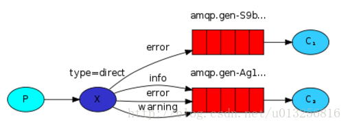

- 我们以 `routingKey="error"` 发送消息到 Exchange ，则消息会路由到 Queue1(`amqp.gen-S9b…`)和 Queue2(`amqp.gen-AG1...`) 。
- 我们以 `routingKey="info"` 或 `routingKey="warning"` 来发送消息，则消息只会路由到 Queue2(`amqp.gen-Agl…`) 。
- 如果我们以其它 `routingKey` 发送消息，则消息不会路由到这两个 Queue 中。
- ~~总结来说，指定 Exchange + routing key ，有且仅会路由到至多一个 Queue 中。😈 极端情况下，如果没有匹配，消息就发送到“空气”中，不会进入任何 Queue 中。~~

> 注：Queue 名字 `amqp.gen-S9b…` 和 `amqp.gen-Agl…` 自动生成的。

### 2.3.1、环境

- RabbitMQ Version:：3.7.23；
- Spring Boot：2.1.6.RELEASE

因为有 Starter POMs，在 Spring Boot 中整合 RabbitMQ 是一件非常容易的事，其中的 [AMQP 模块](https://projects.spring.io/spring-amqp/)就可以很好的支持 RabbitMQ。
我们可以使用 Spring Intializr 或 https://start.spring.io/ 创建一个 Spring Boot 工程，并勾选 RabbitMQ。
或者手动在 pom.xml 文件中加入

```xml
<dependency>
    <groupId>org.springframework.boot</groupId>
    <artifactId>spring-boot-starter-amqp</artifactId>
</dependency>
```

在 [`pom.xml`](https://github.com/YunaiV/SpringBoot-Labs/blob/master/lab-04/lab-04-rabbitmq-demo/pom.xml) 文件中，引入相关依赖。

这里是创建的`Model`项目，父类项目中`Spring Boot`版本为 `2.1.6.RELEASE`。

```xml
<?xml version="1.0" encoding="UTF-8"?>
<project xmlns="http://maven.apache.org/POM/4.0.0" xmlns:xsi="http://www.w3.org/2001/XMLSchema-instance"
         xsi:schemaLocation="http://maven.apache.org/POM/4.0.0 https://maven.apache.org/xsd/maven-4.0.0.xsd">
    <modelVersion>4.0.0</modelVersion>
    <parent>
        <groupId>com.jjcc</groupId>
        <artifactId>rabbitmq-study</artifactId>
        <version>0.0.1-SNAPSHOT</version>
        <relativePath/> <!-- lookup parent from repository -->
    </parent>
    <groupId>com.jjcc.rabbitmq</groupId>
    <artifactId>rabbitmq-basic-demo</artifactId>
    <version>0.0.1-SNAPSHOT</version>
    <name>rabbitmq-basic-demo</name>
    <description>Demo project for Spring Boot</description>

    <dependencies>
        <!-- 实现对 RabbitMQ 的自动化配置 -->
        <dependency>
            <groupId>org.springframework.boot</groupId>
            <artifactId>spring-boot-starter-amqp</artifactId>
        </dependency>

        <dependency>
            <groupId>org.projectlombok</groupId>
            <artifactId>lombok</artifactId>
            <optional>true</optional>
        </dependency>

        <!-- 单元测试 -->
        <dependency>
            <groupId>org.springframework.boot</groupId>
            <artifactId>spring-boot-starter-test</artifactId>
            <scope>test</scope>
        </dependency>
    </dependencies>

</project>

```

### 2.3.2、应用配置文件

[`application.yaml`](https://github.com/YunaiV/SpringBoot-Labs/blob/master/lab-04/lab-04-rabbitmq-demo/src/main/resources/application.yaml) 配置文件。配置如下：

```yml
spring:
  # RabbitMQ配置项，对应RabbitProperties配置类
  rabbitmq:
    host: localhost     # rabbitmq的服务地址
    port: 5672          # 服务端口
    username: guest     # rabbitmq的登陆账号
    password: guest     # 登陆密码
```

- 在 `spring.rabbitmq` 配置项，设置 RabbitMQ 的配置，对应 [RabbitProperties](https://github.com/spring-projects/spring-boot/blob/master/spring-boot-project/spring-boot-autoconfigure/src/main/java/org/springframework/boot/autoconfigure/amqp/RabbitProperties.java) 配置类。
- Spring Boot 提供的 [RabbitAutoConfiguration](https://github.com/spring-projects/spring-boot/blob/master/spring-boot-project/spring-boot-autoconfigure/src/main/java/org/springframework/boot/autoconfigure/amqp/RabbitAutoConfiguration.java) 自动化配置类，实现 RabbitMQ 的自动配置，创建相应的 Producer 和 Consumer 。

### 2.3.3、Application

```java
/**
 * @EnableAsync 开启spring boot异步支持
 * @author Administrator
 */
@EnableAsync
@SpringBootApplication
public class RabbitmqBasicDemoApplication {

    public static void main(String[] args) {
        SpringApplication.run(RabbitmqBasicDemoApplication.class, args);
    }

}
```

- 额外添加了 `@EnableAsync` 注解，因为我们稍后要使用 Spring 提供的异步调用的功能。

### 2.3.4、Demo01Message 消息类

创建 [Demo01Message](https://github.com/YunaiV/SpringBoot-Labs/tree/master/lab-04/lab-04-rabbitmq-demo/src/main/java/cn/iocoder/springboot/lab04/rabbitmqdemo/message/Demo01Message.java) 消息类，提供给当前示例使用。代码如下：

```java
/**
 * 消息类里，我们枚举了 Exchange、Queue、RoutingKey 的名字。
 * @author Administrator
 * @version 1.0.0
 * @description
 * @className Demo01Message.java
 * @createTime 2020年02月19日 15:14:00
 */
@Data
public class Demo01Message implements Serializable {

    public static final String QUEUE = "QUEUE_DEMO_01";

    public static final String EXCHANGE = "EXCHANGE_DEMO_01";

    public static final String ROUTING_KEY = "ROUTING_KEY_01";

    /**
     * 编号
     */
    private Integer id;

}
```

- 注意，要实现 Java `Serializable` 序列化接口。因为 **RabbitTemplate 默认使用 Java 自带的序列化方式，进行序列化 POJO 类型的消息**。
- 在消息类里，我们枚举了 `Exchange`、`Queue`、`RoutingKey` 的名字。

### 2.3.5、RabbitConfig 配置类

在 [`cn.iocoder.springboot.lab04.rabbitmqdemo.config`](https://github.com/YunaiV/SpringBoot-Labs/tree/master/lab-04/lab-04-rabbitmq-demo/src/main/java/cn/iocoder/springboot/lab04/rabbitmqdemo/config) 包下，创建 [RabbitConfig](https://github.com/YunaiV/SpringBoot-Labs/blob/master/lab-04/lab-04-rabbitmq-demo/src/main/java/cn/iocoder/springboot/lab04/rabbitmqdemo/config/RabbitConfig.java) 配置类，添加 Direct Exchange 示例相关的 Exchange、Queue、Binding 的配置。代码如下：

```java
/**
 * 添加 Direct Exchange 示例相关的 Exchange、Queue、Binding 的配置。
 * @author Administrator
 * @version 1.0.0
 * @description
 * @className RabbitConfig.java
 * @createTime 2020年02月19日 16:21:00
 */
@Configuration
public class RabbitConfig {

    /**
     * Direct Exchange示例的配置类
     */
    public static class DirectExchangeDemoConfiguration {

        /**
         * 创建消息队列。相当于一个容器。
         * @title demo01Queue
         * @author Jjcc
         * @return org.springframework.amqp.core.Queue
         * @createTime 2020/2/19 0019 16:41
         */
        @Bean
        public Queue demo01Queue() {
            /*
             para01：队列name
             para02：数据是否持久化
             para03：是否排它
             para04：是否自动删除
             */
            return new Queue(Demo01Message.QUEUE, true, false, false);
        }

        /**
         * 创建 Direct Exchange交换器。消息必须通过exchange发送到queue。
         * @title demo01Exchange
         * @author Jjcc
         * @return org.springframework.amqp.core.DirectExchange
         * @createTime 2020/2/19 0019 16:45
         */
        @Bean
        public DirectExchange demo01Exchange() {
            /*
             para01：交换器name
             para02：是否持久化
             para03：是否自动删除
             */
            return new DirectExchange(Demo01Message.EXCHANGE, true, false);
        }

        /**
         * 创建binding。
         * 消息发送 exchange时，一般指定一个 routing key，通过 binding 与 routing key相匹配后路由到对应的 Queue 中。
         * @title demo01Binding
         * @author Jjcc
         * @return org.springframework.amqp.core.Binding
         * @createTime 2020/2/19 0019 16:51
         */
        @Bean
        public Binding demo01Binding() {
            return BindingBuilder.bind(demo01Queue()).to(demo01Exchange()).with(Demo01Message.ROUTING_KEY);
        }
    }
}
```

- 在 `DirectExchangeDemoConfiguration` 内部静态类中，我们创建了 `Exchange`、`Queue`、`Binding` 三个 Bean ，后续 [RabbitAdmin](https://github.com/spring-projects/spring-amqp/blob/master/spring-rabbit/src/main/java/org/springframework/amqp/rabbit/core/RabbitAdmin.java) 会自动创建交换器、队列、绑定器。

### 2.3.6、Produce 生产者

创建 [Demo01Producer](https://github.com/YunaiV/SpringBoot-Labs/blob/master/lab-04/lab-04-rabbitmq-demo/src/main/java/cn/iocoder/springboot/lab04/rabbitmqdemo/producer/Demo01Producer.java) 类，它会使用 Spring-AMQP 封装提供的 RabbitTemplate ，实现发送消息。代码如下：

```java
/**
 * 生产者
 * @author Administrator
 * @version 1.0.0
 * @description
 * @className Demo01Producer.java
 * @createTime 2020年02月19日 16:56:00
 */
@Component
public class Demo01Producer {

    private RabbitTemplate rabbitTemplate;

    @Autowired
    public Demo01Producer(RabbitTemplate rabbitTemplate) {
        this.rabbitTemplate = rabbitTemplate;
    }

    /**
     * 调用 RabbitTemplate 的同步发送消息方法。
     * convertAndSend(...)：使用特定的路由键将其发送到特定的交换器。
     * @title syncSend
     * @author Jjcc
     * @param id 消息编号
     * @return void
     * @createTime 2020/2/19 0019 17:09
     */
    public void syncSend(Integer id) {
        // 创建 demo01Message 消息
        Demo01Message message = new Demo01Message();
        message.setId(id);
        // 同步发送消息
        rabbitTemplate.convertAndSend(Demo01Message.EXCHANGE, Demo01Message.ROUTING_KEY, message);
    }

    /**
     * 调用 RabbitTemplate 的同步发送消息方法。
     * convertAndSend()：将Java对象转换为Amqp消息并将其发送到具有特定路由键的默认交换器。
     * @title syncSendDefault
     * @author Jjcc
     * @param id
     * @return void
     * @createTime 2020/2/19 0019 17:17
     */
    public void syncSendDefault(Integer id){
        // 创建 demo01Message 消息
        Demo01Message message = new Demo01Message();
        message.setId(id);
        // 同步发送消息
        rabbitTemplate.convertAndSend(Demo01Message.QUEUE, message);
    }

    /**
     * 异步方法。用于调用发送消息方法
     * @title asyncSend
     * @author Jjcc
     * @param id
     * @return org.springframework.util.concurrent.ListenableFuture<java.lang.Void>
     * @createTime 2020/2/19 0019 17:19
     */
    @Async
    public ListenableFuture<Void> asyncSend(Integer id) {
        try {
            // 发送消息
            this.syncSend(id);
            // 返回成功的 Future
            return AsyncResult.forValue(null);
        } catch (Throwable ex) {
            // 返回异常的 Future
            return AsyncResult.forExecutionException(ex);
        }
    }

}
```

- **`RabbitTemplate` 是 [AmqpTemplate](https://github.com/spring-projects/spring-amqp/blob/master/spring-amqp/src/main/java/org/springframework/amqp/core/AmqpTemplate.java) 接口的实现类，所以此时使用 AmqpTemplate 亦可。不过又因为 `RabbitTemplate` 还实现了其它接口，所以操作会更为丰富。**因此，这里我们选择了注入 `RabbitTemplate` 属性。

- `#syncSend(Integer id)` 方法，调用 RabbitTemplate 的同步发送消息方法。方法定义如下：

  ```java
  // AmqpTemplate.java
  
  void convertAndSend(String exchange, String routingKey, Object message) throws AmqpException;
  ```

  

  - 指定 Exchange + RoutingKey ，从而路由到一个 Queue 中。

- `#syncSendDefault(Integer id)` 方法，也调用 RabbitTemplate 的同步发送消息方法。方法定义如下：

  ```java
  // AmqpTemplate.java
  
  void convertAndSend(String routingKey, Object message) throws AmqpException;
  ```

  

  - 是不是觉得有点奇怪，这里我们传入的 RoutingKey 为队列名？！因为 RabbitMQ 有一条默认的 [Exchange: (AMQP default)](https://emacsist.github.io/2015/12/06/rabbitmq中的基本概念/#default-exchange-默认交换机) 规则：`The default exchange is implicitly bound to every queue, with a routing key equal to the queue name. It is not possible to explicitly bind to, or unbind from the default exchange. It also cannot be deleted` 。
  - 翻译过来的意思：默认交换器，隐式地绑定到每个队列，路由键等于队列名称。
  - 所以，此处即使我们传入的 RoutingKey 为队列名，一样可以发到对应队列。

### 2.3.7、Consumer 消费者

创建 [Demo01Consumer](https://github.com/YunaiV/SpringBoot-Labs/blob/master/lab-04/lab-04-rabbitmq-demo/src/main/java/cn/iocoder/springboot/lab04/rabbitmqdemo/consumer/Demo01Consumer.java) 类，消费消息。代码如下：

```java
/**
 * 消费端。
 * @RabbitListener 根据队列名监听指定的消息队列，是一个数组。
 * @author Administrator
 * @version 1.0.0
 * @description
 * @className Demo01Consumer.java
 * @createTime 2020年02月19日 21:07:00
 */
@Log4j2
@Component
@RabbitListener(queues = Demo01Message.QUEUE)
public class Demo01Consumer {

    /**
     * 通过 @RabbitHandler 注解申明了处理消息的方法，
     * @title onMessage
     * @author Jjcc
     * @param message 方法入参为消息的类型。
     * @return void
     * @createTime 2020/2/19 0019 21:15
     */
    @RabbitHandler
    public void  onMessage(Demo01Message message) {
        log.info("[onMessage][线程编号：{}，消息内容：{}]", message.getId(), message.toString());
    }

    /**
     * 获得消费消息的更多信息，例如说，RoutingKey、创建时间等等信息
     * @title onMessage
     * @author Jjcc
     * @param message 消息对象。
     * @return void
     * @createTime 2020/2/19 0019 21:17
     */
//    @RabbitHandler(isDefault = true)
//    public void onMessage(Message message) {
//        log.info("[onMessage][线程编号:{} 消息内容：{}]", Thread.currentThread().getId(), message);
//    }
}
```

- 在类上，添加了 [`@RabbitListener`](https://github.com/spring-projects/spring-amqp/blob/master/spring-rabbit/src/main/java/org/springframework/amqp/rabbit/annotation/RabbitListener.java) 注解，声明了消费的队列是 `"QUEUE_DEMO_01"` 。
- 在方法上，添加了 [`@RabbitHandler`](https://github.com/spring-projects/spring-amqp/blob/master/spring-rabbit/src/main/java/org/springframework/amqp/rabbit/annotation/RabbitHandler.java) 注解，申明了处理消息的方法。同时，方法入参为消息的类型。这里，我们设置了 `Demo01Message`。
- 如果我们想要获得消费消息的更多信息，例如说，`RoutingKey`、创建时间等等信息，则可以考虑使用**注释掉的那段代码**，通过方法入参为 [`org.springframework.amqp.core.Message`](https://github.com/spring-projects/spring-amqp/blob/master/spring-amqp/src/main/java/org/springframework/amqp/core/Message.java) 类型。不过绝大多数情况下，我们并不需要这么做。

### 2.3.8、测试

编写三个单元测试方法，调用 Demo01Producer 三个发送消息的方式。代码如下：

```
// Demo01ProducerTest.java

@RunWith(SpringRunner.class)
@SpringBootTest(classes = Application.class)
public class Demo01ProducerTest {

    private Logger logger = LoggerFactory.getLogger(getClass());

    @Autowired
    private Demo01Producer producer;

    @Test
    public void testSyncSend() throws InterruptedException {
        int id = (int) (System.currentTimeMillis() / 1000);
        producer.syncSend(id);
        logger.info("[testSyncSend][发送编号：[{}] 发送成功]", id);

        // 阻塞等待，保证消费
        new CountDownLatch(1).await();
    }

    @Test
    public void tesSyncSendDefault() throws InterruptedException {
        int id = (int) (System.currentTimeMillis() / 1000);
        producer.syncSendDefault(id);
        logger.info("[tesSyncSendDefault][发送编号：[{}] 发送成功]", id);

        // 阻塞等待，保证消费
        new CountDownLatch(1).await();
    }

    @Test
    public void testAsyncSend() throws InterruptedException {
        int id = (int) (System.currentTimeMillis() / 1000);
        producer.asyncSend(id).addCallback(new ListenableFutureCallback<Void>() {

            @Override
            public void onFailure(Throwable e) {
                logger.info("[testASyncSend][发送编号：[{}] 发送异常]]", id, e);
            }

            @Override
            public void onSuccess(Void aVoid) {
                logger.info("[testASyncSend][发送编号：[{}] 发送成功，发送成功]", id);
            }

        });
        logger.info("[testASyncSend][发送编号：[{}] 调用完成]", id);

        // 阻塞等待，保证消费
        new CountDownLatch(1).await();
    }

}
```

- 比较简单，胖友自己看下三个单元测试方法。

我们来执行 `#testSyncSend()` 方法，测试同步发送消息。控制台输出如下：

```
# Producer 同步发送消息成功。
2019-12-15 00:19:18.736  INFO 87164 --- [           main] c.i.s.l.r.producer.Demo01ProducerTest    : [testSyncSend][发送编号：[1575908358] 发送成功]

# Demo01Consumer 成功消费了该消息
2019-12-15 00:19:18.751  INFO 87164 --- [ntContainer#0-1] c.i.s.l.r.consumer.Demo01Consumer        : [onMessage][线程编号:17 消息内容：Demo01Message{id=1575908358}]
```

- 同步发送的消息，成功被消费。

我们再来执行 `#tesSyncSendDefault()` 方法，测试另一个同步发送消息。控制台输出如下：

```
# Producer 同步发送消息成功。
2019-12-15 00:20:50.226  INFO 87515 --- [           main] c.i.s.l.r.producer.Demo01ProducerTest    : [tesSyncSendDefault][发送编号：[1575908450] 发送成功]

# Demo01Consumer 成功消费了该消息
2019-12-15 00:20:50.240  INFO 87515 --- [ntContainer#0-1] c.i.s.l.r.consumer.Demo01Consumer        : [onMessage][线程编号:17 消息内容：Demo01Message{id=1575908450}]
```

- 同步发送的消息，成功也被消费。

我们最后来执行 `#testAsyncSend()` 方法，测试异步发送消息。控制台输出如下：

```
# Producer 异步发送消息的调用完成。
2019-12-15 00:22:48.891  INFO 88018 --- [           main] c.i.s.l.r.producer.Demo01ProducerTest    : [testASyncSend][发送编号：[1575908568] 调用完成]

# Producer 异步发送消息成功。【回调】
2019-12-15 00:22:48.905  INFO 88018 --- [         task-1] c.i.s.l.r.producer.Demo01ProducerTest    : [testASyncSend][发送编号：[1575908568] 发送成功，发送成功]

# Demo01Consumer 成功消费了该消息
2019-12-15 00:22:48.918  INFO 88018 --- [ntContainer#0-1] c.i.s.l.r.consumer.Demo01Consumer        : [onMessage][线程编号:17 消息内容：Demo01Message{id=1575908568}]
```

- 异步发送的消息，成功也被消费。

# 3、RabbitMQ工作模式

## 3.1、work queues 工作队列模式

### 3.1.1、模式说明

**工作队列**，又称任务队列，**主要思想是避免立即执行资源密集型任务，并且必须等待完成**。相反地，我们进行任务调度，我们将一个任务封装成一个消息，并将其发送到队列。工作进程在后台运行不断的从队列中取出任务然后执行。**当你运行了多个工作进程时，这些任务队列中的任务将会被工作进程共享执行**。 这个概念在 Web 应用程序中特别有用，在短时间 HTTP 请求内需要执行复杂的任务。

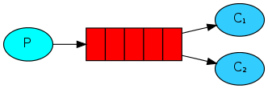

`work queue`**多个消费端共同消费同一个队列中的消息**。**应用场景：对于 任务过重或任务较多情况使用工作队列可以提高任务处理的速度。**

### 3.1.2、准备

类似于图片大小被调整或 pdf 文件被渲染，所以我们通过 `#sleep ()` 方法来模拟这种情况。我们在字符串中加上点号（.）来表示任务的复杂程度，一个点（.）将会耗时 1 秒钟。比如 “Hello…” 就会耗时 3 秒钟。

### 3.1.3、代码整合

#### 3.1.3.1、配置类

```java
/**
 * 消息配置类
 * @author Administrator
 * @version 1.0.0
 * @description
 * @className RabbitConfig.java
 * @createTime 2020年02月20日 14:19:00
 */
@Configuration
public class RabbitWorkQueueConfig {

    /**
     * 创建消息队列
     * @title queue
     * @author Jjcc
     * @return org.springframework.amqp.core.Queue
     * @createTime 2020/2/20 0020 14:21
     */
    @Bean
    public Queue queue() {
        return new Queue("queue_demo01");
    }

    /**
     * 静态内部类，定义了两个消息消费者。
     */
    public static class ReceiverConfig {
        @Bean
        public Demo02Consumer receiver1() {
            return new Demo02Consumer(1);
        }

        @Bean
        public Demo02Consumer receiver2() {
            return new Demo02Consumer(2);
        }

    }

    /**
     * 创建一个消息侦听器容器。
     * @title prefetchOneRabbitListenerContainerFactory
     * @author Jjcc
     * @param rabbitConnectionFactory 消息组件连接工厂
     * @return org.springframework.amqp.rabbit.listener.RabbitListenerContainerFactory<org.springframework.amqp.rabbit.listener.SimpleMessageListenerContainer>
     * @createTime 2020/2/20 0020 17:57
     */
    @Bean
    public RabbitListenerContainerFactory<SimpleMessageListenerContainer>
            prefetchOneRabbitListenerContainerFactory(ConnectionFactory rabbitConnectionFactory) {

        SimpleRabbitListenerContainerFactory factory = new SimpleRabbitListenerContainerFactory();
        factory.setPrefetchCount(1);
        factory.setConnectionFactory(rabbitConnectionFactory);
        return factory;
    }
}
```

#### 3.1.3.2、生产者

以添加点号（.）的方式来人为的增加该任务的时长，字符串中的每个点号（.）都会增加 1s 的耗时。

```java
/**
 * @author Administrator
 * @version 1.0.0
 * @description
 * @className Demo02Produce.java
 * @createTime 2020年02月20日 14:35:00
 */
@Component
@Log4j2
public class Demo02Produce {

    @Autowired
    private RabbitTemplate template;

    private AtomicInteger dots = new AtomicInteger();
    private AtomicInteger count = new AtomicInteger();

    /**
     * 消息发布者
     * @title send
     * @author Jjcc
     * @return void
     * @createTime 2020/2/20 0020 14:38
     */
    public void send() {
        StringBuilder sb = new StringBuilder("hello");
        if (dots.getAndIncrement() == 3) {
            dots.set(1);
        }

        for (int i = 0; i < dots.get(); i++) {
            sb.append(".");
        }
        sb.append(count.incrementAndGet());
        template.convertAndSend("queue_demo01", sb.toString());
        log.info(" [x] Sent '" + sb.toString() + "'");
    }

}
```

#### 3.1.3.3、消费者

通过 `doWork ()` 方法模拟了一个耗时的虚假任务，它需要为消息体中每一个点号（.）模拟 1 秒钟的操作。并且我们为消费者增加了一个实例编号，以知道是哪个实例消费了消息和处理的时长。

```java
/**
 * 消费者
 * @author Administrator
 * @version 1.0.0
 * @description
 * @className Demo02Consumer.java
 * @createTime 2020年02月20日 14:47:00
 */
@Log4j2
@RabbitListener(queues = "queue_demo01", containerFactory = "prefetchOneRabbitListenerContainerFactory")
public class Demo02Consumer {

    private int instance;

    public Demo02Consumer(int instance) {
        this.instance = instance;
    }

    /**
     * 消费者。
     * @title receive
     * @author Jjcc
     * @param in 编号
     * @return void
     * @createTime 2020/2/20 0020 14:54
     */
    @RabbitHandler
    public void receive(String in) throws InterruptedException {
        log.info("[onMessage][编号：{}，消息内容：{}]", this.instance, in);
        doWork(in);
    }

    private void doWork(String in) throws InterruptedException {
        char[] chars = in.toCharArray();
        for (char aChar : chars) {
           if ('.' == aChar) {
               Thread.sleep(1000);
           }
        }
    }

}
```

#### 3.1.3.4、测试

```java
/**
 * @author Administrator
 * @version 1.0.0
 * @description
 * @className WorkQueuePatternTest.java
 * @createTime 2020年02月20日 15:05:00
 */
@RunWith(SpringRunner.class)
@SpringBootTest(classes = RabbitmqBasicDemoApplication.class)
public class WorkQueuePatternTest {

    @Autowired
    private Demo02Produce produce;

    @Test
    public void testSend() throws InterruptedException {
        for (int i = 0; i < 10; i++) {
            produce.send();
        }
        new CountDownLatch(1).await();
    }
}
```

**运行后输出：**

```
2020-02-20 20:51:50.532  INFO 8272 --- [           main] c.j.r.workqueuer.producer.Demo02Produce  :  [x] Sent 'hello.1'
2020-02-20 20:51:50.534  INFO 8272 --- [           main] c.j.r.workqueuer.producer.Demo02Produce  :  [x] Sent 'hello..2'
2020-02-20 20:51:50.534  INFO 8272 --- [           main] c.j.r.workqueuer.producer.Demo02Produce  :  [x] Sent 'hello...3'
2020-02-20 20:51:50.534  INFO 8272 --- [           main] c.j.r.workqueuer.producer.Demo02Produce  :  [x] Sent 'hello.4'
2020-02-20 20:51:50.535  INFO 8272 --- [           main] c.j.r.workqueuer.producer.Demo02Produce  :  [x] Sent 'hello..5'
2020-02-20 20:51:50.535  INFO 8272 --- [           main] c.j.r.workqueuer.producer.Demo02Produce  :  [x] Sent 'hello...6'
2020-02-20 20:51:50.535  INFO 8272 --- [           main] c.j.r.workqueuer.producer.Demo02Produce  :  [x] Sent 'hello.7'
2020-02-20 20:51:50.535  INFO 8272 --- [           main] c.j.r.workqueuer.producer.Demo02Produce  :  [x] Sent 'hello..8'
2020-02-20 20:51:50.535  INFO 8272 --- [           main] c.j.r.workqueuer.producer.Demo02Produce  :  [x] Sent 'hello...9'
2020-02-20 20:51:50.535  INFO 8272 --- [           main] c.j.r.workqueuer.producer.Demo02Produce  :  [x] Sent 'hello.10'
!!!!!!!!!!!!!
2020-02-20 20:51:50.544  INFO 8272 --- [ntContainer#2-1] c.j.r.w.consumer.Demo02Consumer          : [onMessage][编号：2，消息内容：hello..2]
2020-02-20 20:51:50.544  INFO 8272 --- [ntContainer#1-1] c.j.r.w.consumer.Demo02Consumer          : [onMessage][编号：1，消息内容：hello.1]
2020-02-20 20:51:51.551  INFO 8272 --- [ntContainer#1-1] c.j.r.w.consumer.Demo02Consumer          : [onMessage][编号：1，消息内容：hello...3]
2020-02-20 20:51:52.547  INFO 8272 --- [ntContainer#2-1] c.j.r.w.consumer.Demo02Consumer          : [onMessage][编号：2，消息内容：hello.4]
2020-02-20 20:51:53.551  INFO 8272 --- [ntContainer#2-1] c.j.r.w.consumer.Demo02Consumer          : [onMessage][编号：2，消息内容：hello..5]
2020-02-20 20:51:54.554  INFO 8272 --- [ntContainer#1-1] c.j.r.w.consumer.Demo02Consumer          : [onMessage][编号：1，消息内容：hello...6]
2020-02-20 20:51:55.555  INFO 8272 --- [ntContainer#2-1] c.j.r.w.consumer.Demo02Consumer          : [onMessage][编号：2，消息内容：hello.7]
2020-02-20 20:51:56.559  INFO 8272 --- [ntContainer#2-1] c.j.r.w.consumer.Demo02Consumer          : [onMessage][编号：2，消息内容：hello..8]
2020-02-20 20:51:57.558  INFO 8272 --- [ntContainer#1-1] c.j.r.w.consumer.Demo02Consumer          : [onMessage][编号：1，消息内容：hello...9]
2020-02-20 20:51:58.563  INFO 8272 --- [ntContainer#2-1] c.j.r.w.consumer.Demo02Consumer          : [onMessage][编号：2，消息内容：hello.10]

```

### 3.1.4、prefetch

默认情况下，**如果有多个消费者同时订阅同一个 Queue 中的消息，Queue 中的消息会被平摊给多个消费者。平均而言，每个消费者将获得相同数量的消息**。这种分配消息的方式称为**循环调度**（`Round-robin`）。

这时**如果每个消息的处理时间不同，就有可能会导致某些消费者一直在忙，而另外一些消费者很快就处理完手头工作并一直空闲的情况**。

> 我们可以通过设置 `prefetchCount` 来限制 `Queue` 每次发送给每个消费者的消息数，比如我们设置 `prefetchCount=1`，则 **Queue 每次给每个消费者发送一条消息；消费者处理完这条消息后 `Queue` 会再给该消费者发送一条消息。以此达到 公平转发`fail dispatch`**

从上方测试类输出结果中，消费者这端的输出可以看出来，instance 1 得到的任务编号始终是奇数（Hello.1，Hello…3，Hello..5，Hello.7），而 instance 2 得到的任务编号始终是偶数。

这里设计的问题就是之前在[基础概念](https://windmt.com/2018/04/12/rabbitmq-0-introduction/)里讲到的调度策略的问题了。要实现公平调度（Fair dispatch）就是设置 prefetch 的值，**实现方式有两种**。

####  3.1.4.1、全局设置

在 `application.yml` 中设置 `spring.rabbitmq.listener.simple.prefetch=1` 即可，这会影响到本 Spring Boot 应用中所有使用默认 `SimpleRabbitListenerContainerFactory` 的消费者。

```yml
spring:
  # RabbitMQ配置项，对应RabbitProperties配置类
  rabbitmq:
    host: localhost     # rabbitmq的服务地址
    port: 5672          # 服务端口
    username: guest     # rabbitmq的登陆账号
    password: guest     # 登陆密码
    listener:
      simple:
        prefetch: 1     # 设置预读取数，消费端消费完特定数目消息后消费端才能拿取消息，此配置用于保证公平转发；是全局的。
```

改了配置后再运行，可以看到 instance 1 可以获取到”Hello…6”、”Hello…12” 了。

```
Ready ... running for 60000ms
instance 1 [x] Received 'Hello.1'
instance 2 [x] Received 'Hello..2'
instance 1 [x] Done in 1.004s
instance 1 [x] Received 'Hello...3'
instance 2 [x] Done in 2.008s
instance 2 [x] Received 'Hello.4'
instance 2 [x] Done in 1.004s
instance 2 [x] Received 'Hello..5'
instance 1 [x] Done in 3.012s
instance 1 [x] Received 'Hello...6'
instance 2 [x] Done in 2.007s
instance 2 [x] Received 'Hello.7'
instance 2 [x] Done in 1.004s
instance 2 [x] Received 'Hello..8'
instance 1 [x] Done in 3.011s
instance 1 [x] Received 'Hello...9'
instance 2 [x] Done in 2.007s
instance 2 [x] Received 'Hello.10'
instance 2 [x] Done in 1.006s
instance 2 [x] Received 'Hello..11'
instance 1 [x] Done in 3.01s
instance 1 [x] Received 'Hello...12'
```

####  3.1.4.2、特定消费者

 上边是改了全局的消费者，如果只针对特定的消费者的话，又怎么处理呢？
我们可以通过自定义 `RabbitListenerContainerFactory` 来实现。

```java
/**
 * 创建一个消息侦听器容器。
 * @title prefetchOneRabbitListenerContainerFactory
 * @author Jjcc
 * @param rabbitConnectionFactory 消息组件连接工厂
 * @return org.springframework.amqp.rabbit.listener.RabbitListenerContainerFactory<org.springframework.amqp.rabbit.listener.SimpleMessageListenerContainer>
 * @createTime 2020/2/20 0020 17:57
 */
@Bean
public RabbitListenerContainerFactory<SimpleMessageListenerContainer>
        prefetchOneRabbitListenerContainerFactory(ConnectionFactory rabbitConnectionFactory) {

    SimpleRabbitListenerContainerFactory factory = new SimpleRabbitListenerContainerFactory();
    // 设置 preftechCount=1；消费端每次只能获取一个消息，只有消息消费完后才能继续获取。
    factory.setPrefetchCount(1);
    factory.setConnectionFactory(rabbitConnectionFactory);
    return factory;
}
```

然后在特定的消费者上指定`@RabbitListener()`注解的`containerFactory`参数的值

```java
@RabbitListener(queues = "hello", containerFactory = "prefetchTenRabbitListenerContainerFactory")
public void receive(String in) {
    System.out.println(" [x] Received '" + in + "'")
}
```

### 3.1.5、小结

如果有多个消费者监听同一个队列，那么消费者之间对于同一个消息的关系是**竞争**的。

## 3.2、订阅模式类型

订阅模式示例图：

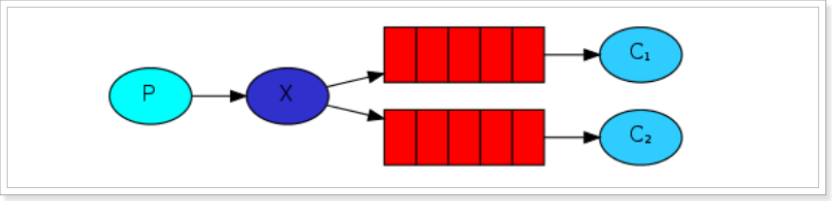

前面2个案例中，只有3个角色：

- producer：生产者，发送消息的程序。**事实上，发布者（producer）甚至不知道消息是否已经被投递到队列**。
- consumer：消费者，接收消息的程序，会一直等待消息的到来。
- queue：消息队列，接收producer发送的消息，然后存储消息的容器。

而在订阅模型中，多了一个exchange角色，而且过程略有变化：

- producer：生产者，发送消息的程序，不再直接发送给queue，而是发给 `Exchange`（交换机）。

- queue：消息队列，接收消息，缓冲消息。

- exchange：交换机，图中的X。**一方面，接收生产者发送的消息。另一方面，知道如何处理消息，例如递交给**
  **某个特别队列、递交给所有队列、或是将消息丢弃**。到底如何操作，取决于`Exchange`的类型。`Exchange`有常见以下4种类型：

  - `Direct`：定向，把消息交给符合指定`routing key` 的队列
  - `Fanout`：广播，将消息交给所有绑定到交换机的队列
  - `Topic`：通配符，把消息交给符合`routing pattern`（路由模式） 的队列
- `Headers`：参数，`Headers Exchange` 不依赖于 `routing key` 与 `binding key` 的匹配规则来路由消息，而是根据发送的消息内容中的 `headers` 属性进行匹配。
  
  **`Exchange`（交换机）只负责转发消息，不具备存储消息的能力**，因此如果没有任何队列与`Exchange`绑定，或者没有符合路由规则的队列，那么**消息会丢失**！

## 3.3、Publish/Subscribe 发布与订阅

### 3.3.1、模式说明

使用 `fanout`类型的 `exchange`来实现。

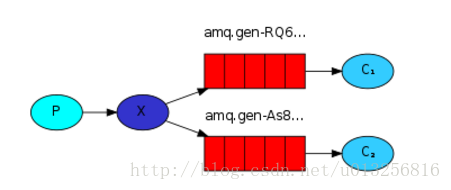

发布订阅模式：

1. 每个消费者监听自己的队列。
2. 生产者将消息发送给 `broker`（Exchange），由交换器将消息转发到绑定此交换机的每个队列，每个绑定交换机的队列都将收到消息。

### 3.3.2、Exchange 交换器

RabbitMQ 消息模型的**核心理念是：发布者（producer）不会直接发送任何消息给队列。事实上，发布者（producer）甚至不知道消息是否已经被投递到队列**。

> 发布者（producer）只需要把消息发送给一个交换器（exchange）。**交换器非常简单，它一边从发布者方接收消息，一边把消息推送到队列。交换器必须知道如何处理它接收到的消息，是应该推送到指定的队列还是多个队列，或者是直接忽略消息。这些规则是通过交换器类型（exchange type）来定义的**。

[](https://src.windmt.com/img/006tNc79ly1fq9tchttwrj3098033746.jpg)

有几个可供选择的交换器类型：`direct`, `topic`, `headers` 和 `fanout`。我们在这里主要说明最后一个 ——fanout。`fanout exchange` 很简单，你可能从名字上就能猜测出来，它把消息发送给它所知道的所有队列。（**发布与订阅模式需要 `fanout`类型的 `Echange`实现**）。

#### 3.3.2.1、未命名交换器 Nameless Exchange

在工作对类模式中，我们并没有配置**交换器**，但依然能够将消息发送到队列。这是怎么回事？因为**使用了默认的交换器，它是用空字符串（””）来标识的**。

work Queue模式中是这样发送消息的：

```java
template.convertAndSend(queue.getName(), message);
```

而具体源码如下，可以看出之前我们使用的是默认的空字符定义的交换器：

```java
// RabbitTemplate

public void convertAndSend(String routingKey, final Object object) throws AmqpException {
	convertAndSend(this.exchange, routingKey, object, (CorrelationData) null);
}

private volatile String exchange = DEFAULT_EXCHANGE;

/\*_ Alias for amq.direct default exchange. _/
private static final String DEFAULT_EXCHANGE = "";
```

> 源码中`#convertAndSend()`第一个参数是指定 `routing key`，但我们传入的是 `queue_name`；其实在**使用默认的空字符串的交换器时，会隐式地绑定到每个队列，路由键等于队列名称**。
>

### 3.3.3、临时队列 Temporary queues

我们之前使用的是具有指定名称的队列（hello 和 work-queues）。**能够命名队列对我们而言至关重要 —— 我们需要将工作进程指向同一个队列。当我们想要在生产者和消费者之间共享队列时，给队列一个名字很重要**。

> 但是我们的日志记录器并不是这样。我们希望记录到所有的日志消息，而不仅仅是它们的一部分。我们也只对当前的消息感兴趣，而对旧的消息不感兴趣。为了解决这个问题，我们需要做两件事情。
>
> 首先，每当我们连接到 RabbitMQ，我们需要一个新的空的队列。我们可以创建一个具有随机名称的队列，或者最好让**服务器为我们选择一个随机的队列名**。
> 其次，**当与消费者（consumer）断开连接的时候，这个队列应当被立即删除**。

在 Spring AMQP 中，我们可以使用 `AnonymousQueue` 来作为**临时队列。它是一个非持久化的、独占的、可自动删除的队列。**

```java
@Bean
public Queue autoDeleteQueue01() {
	new AnonymousQueue();
}

@Bean
public Queue autoDeleteQueue02() {
	new AnonymousQueue();
}
```

此时我们的队列名字看起来会像这样：`amq.gen-JzTY20BRgKO-HjmUJj0wLg`

### 3.3.4、绑定 bindings

在**`1.10、Binding key 绑定ID`**中有简括。

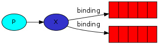

交换器和队列之间的关系称为**绑定**。每个 `Queue` 都有一个绑定。

```java
@Bean
public Binding binding01(Exchange exchange, Queue queue) {
    // return BindingBuilder.bind(queue).to(exchange).with(routing_key);
    return BindingBuilder.bind(queue).to(exchange);
}
```

> **注意：**`fanout`模式的 `exchange`下，队列和交换器进行绑定操作时，不需要进行路由配对操作 `.with(routing_key)`。 因为**`fanout` 类型的 `Exchange` 会无视 `binding key`与  `routing key`匹配操作，而是将消息路由到所有绑定到该 `Exchange` 的 `Queue`**。

### 3.3.5、代码整合

#### 3.3.5.1、Message 消息体

```java
/**
 * 消息类。
 * @author Administrator
 * @version 1.0.0
 * @className Message.java
 * @createTime 2020年02月21日 16:47:00
 */
@Data
public class Message implements Serializable {

    public static final String QUEUE_A = "QUEUE_PS_A";

    public static final String QUEUE_B = "QUEUE_PS_B";

    public static final String EXCHANGE = "EXCHANGE_PS";

    /**
     * 编号
     */
    private Integer id;

    /**
     * 消息主题
     * @title
     * @author Jjcc
     * @return
     * @createTime 2020/2/21 0021 16:51
     */
    private String body;

}
```

- **未**定意思 RoutingKey 的名字。因为，**Fanout Exchange 仅需要 Exchange 即可**。
- 定义**两个** Queue 的名字。因为，我们要测试 Fanout Exchange 投递到多个 Queue 的效果。

#### 3.3.5.2、RabbitConfig

添加 Fanout Exchange 示例相关的 Exchange、Queue、Binding 的配置。代码如下：

```java
/**
 * 配置类
 * @author Administrator
 * @version 1.0.0
 * @description
 * @className RabbitPSPatternConfig.java
 * @createTime 2020年02月21日 16:47:00
 */
@Configuration
public class RabbitPsPatternConfig {

    /**
     * fanout 类型的 Exchange。
     * @title fanoutExchange
     * @author Jjcc
     * @return org.springframework.amqp.core.FanoutExchange
     * @createTime 2020/2/21 0021 17:02
     */
    @Bean
    public FanoutExchange fanoutExchange() {
        return new FanoutExchange(Message.EXCHANGE, true, false);
    }

    /**
     * 创建 临时队列 A。
     * anonymousQueue：临时队列；消息非持久化的，与rabbitmq断开连接自动删除队列，队列名随机的。
     * @title autoDeleteQueueA
     * @author Jjcc
     * @return org.springframework.amqp.core.Queue
     * @createTime 2020/2/21 0021 17:03
     */
    @Bean
    public Queue autoDeleteQueueA() {
        return new AnonymousQueue();
    }

    /**
     * 创建 临时队列 B。
     * anonymousQueue：临时队列；消息非持久化的，与rabbitmq断开连接自动删除队列，队列名随机的。
     * @title autoDeleteQueueA
     * @author Jjcc
     * @return org.springframework.amqp.core.Queue
     * @createTime 2020/2/21 0021 17:03
     */
    @Bean
    public Queue autoDeleteQueueB() {
        return new AnonymousQueue();
    }

    /**
     * 队列与 exchange 绑定；fanoutExchange 不需要指定 routing key；
     * @title bindingA
     * @author Jjcc
     * @param fanoutExchange 上面创建的 fanout类型的Exchange
     * @param autoDeleteQueueA 队列A
     * @return org.springframework.amqp.core.Binding
     * @createTime 2020/2/21 0021 17:17
     */
    @Bean
    public Binding bindingA(FanoutExchange fanoutExchange, Queue autoDeleteQueueA) {
        return BindingBuilder.bind(autoDeleteQueueA).to(fanoutExchange);
    }

    /**
     * 队列与 exchange 绑定；fanoutExchange 不需要指定 routing key；
     * @title bindingB
     * @author Jjcc
     * @param fanoutExchange 上面创建的 fanout类型的Exchange
     * @param autoDeleteQueueB 队列B
     * @return org.springframework.amqp.core.Binding
     * @createTime 2020/2/21 0021 17:17
     */
    @Bean
    public Binding bindingB(FanoutExchange fanoutExchange, Queue autoDeleteQueueB) {
        return BindingBuilder.bind(autoDeleteQueueB).to(fanoutExchange);
    }
}
```

- 在 FanoutExchangeDemoConfiguration 内部静态类中，我们**也是**创建了 Exchange、Queue、Binding 三个 Bean 。有差异点的是，这次我们创建的是 [FanoutExchange](https://github.com/spring-projects/spring-amqp/blob/master/spring-amqp/src/main/java/org/springframework/amqp/core/FanoutExchange.java) 。
- 同时，因为我们要投递到两个 Queue 中，所以我们创建了两个 Binding 。

#### 3.3.5.3、Producer 生产者

发送消息。代码如下：

```java
/**
 * 生产者
 * @author Administrator
 * @version 1.0.0
 * @description
 * @className PsProducer.java
 * @createTime 2020年02月21日 16:48:00
 */
@Log4j2
@Component
public class PsProducer {

    private RabbitTemplate template;

    private AtomicLong dost = new AtomicLong(0);
    private AtomicLong count = new AtomicLong(0);

    @Autowired
    public PsProducer(RabbitTemplate template) {
        this.template = template;
    }
    
    /**
     * 消息发送者。
     * 这里发送消息的 convertAndSend方法的 routing key 参数设置为""，因为 fanoutExchange不需要。
     * @title asyncSend
     * @author Jjcc 
     * @param message 消息体
     * @return void
     * @createTime 2020/2/21 0021 23:09
     */
    @Async
    public void asyncSend(Message message) {

        if (dost.incrementAndGet() == 3) {
            dost.set(1);
        }

        StringBuilder sb = new StringBuilder();
        for (long i = 0; i < dost.get(); i++) {
            sb.append(".");
        }
        message.setBody(message.getBody() + sb.toString() + "-----" + count.incrementAndGet());

        template.convertAndSend(Message.EXCHANGE, "", message);

        log.info(" [x] Sent '" + message.toString() + "'");
    }
}
```

- 发出消息的生产者程序与**工作队列模式**的没有多大区别。最重要的变化是我们现在要发布消息给我们的 `fanout exchange`，而不是默认的交换器。发送时我们需要提供一个 `routingKey`，但是**对于 `fanout exchange`，这个值将被忽略，因为不需要**。

> 注意：
>
> 1. 禁止发布到不存在的 `exchange`。
> 2. **如果发布到没有任何绑定任何队列的 `exchange`，消息将丢失**。

#### 3.3.5.4、Consumer 消费者

定义两个消费者分别监听两个队列，代码如下：

```java
/**
 * 消费者。
 * 定义两个消费者分别监听两个队列
 * @author Administrator
 * @version 1.0.0
 * @description
 * @className PsConsumer.java
 * @createTime 2020年02月21日 16:47:00
 */
@Component
@Log4j2
public class PsConsumer {

    /**
     * @RabbitListener也可用于方法之上。
     * 注解参数使用 SpEL表达式 获取 已经注册进IOC容器的队列对象。
     * @title receiveA
     * @author Jjcc
     * @param message 消息体
     * @return void
     * @createTime 2020/2/21 0021 22:52
     */
    @RabbitListener(queues = "#{autoDeleteQueueA.name}")
    public void receiveA(Message message) {
       log.info("[onMessage][线程编号:{} 消息内容：{}]", "A", message.toString());
    }

    /**
     * @RabbitListener也可用于方法之上。
     * 注解参数使用 SpEL表达式 获取 已经注册进IOC容器的队列对象。
     * @title receiveB
     * @author Jjcc
     * @param message 消息体
     * @return void
     * @createTime 2020/2/21 0021 22:54
     */
    @RabbitListener(queues = "#{autoDeleteQueueB.name}")
    public void receiveB(Message message) {
        log.info("[onMessage][线程编号:{} 消息内容：{}]", "B", message.toString());
    }
}
```

- 两个消费者，分别消费 `"QUEUE_DEMO_03_A"`、`"QUEUE_DEMO_03_B"` 队列。

#### 3.3.5.5、测试

编写一个单元测试方法。代码如下：

```java
/**
 * @author Jjcc
 * @version 1.0.0
 * @className PublishSubscribePatternTest.java
 * @createTime 2020年02月21日 22:40:00
 */
@RunWith(SpringRunner.class)
@SpringBootTest(classes = RabbitmqBasicDemoApplication.class)
public class PublishSubscribePatternTest {

    @Autowired
    private PsProducer producer;

    @Test
    public void test() throws InterruptedException {
        for (int i = 0; i < 10; i++) {
            Message message = new Message();
            message.setId((int) (System.currentTimeMillis() / 100));
            message.setBody("hello world：" + i);
            producer.asyncSend(message);
        }

        new CountDownLatch(1).await();
    }
}
```

执行 `#test()`方法，控制台输出如下：

```
2020-02-21 22:49:47.546  INFO 6416 --- [         task-1] c.j.r.p.producer.PsProducer              :  [x] Sent 'Message(id=-1356903309, body=hello world：0.-----1)'
2020-02-21 22:49:47.545  INFO 6416 --- [         task-5] c.j.r.p.producer.PsProducer              :  [x] Sent 'Message(id=-1356903309, body=hello world：4..-----2)'
2020-02-21 22:49:47.547  INFO 6416 --- [         task-1] c.j.r.p.producer.PsProducer              :  [x] Sent 'Message(id=-1356903309, body=hello world：8.-----9)'
2020-02-21 22:49:47.550  INFO 6416 --- [         task-5] c.j.r.p.producer.PsProducer              :  [x] Sent 'Message(id=-1356903309, body=hello world：9..-----10)'
2020-02-21 22:49:47.551  INFO 6416 --- [         task-8] c.j.r.p.producer.PsProducer              :  [x] Sent 'Message(id=-1356903309, body=hello world：7..-----8)'
2020-02-21 22:49:47.552  INFO 6416 --- [         task-3] c.j.r.p.producer.PsProducer              :  [x] Sent 'Message(id=-1356903309, body=hello world：2..-----4)'
2020-02-21 22:49:47.546  INFO 6416 --- [         task-7] c.j.r.p.producer.PsProducer              :  [x] Sent 'Message(id=-1356903309, body=hello world：6.-----7)'
2020-02-21 22:49:47.546  INFO 6416 --- [         task-2] c.j.r.p.producer.PsProducer              :  [x] Sent 'Message(id=-1356903309, body=hello world：1.-----5)'
2020-02-21 22:49:47.546  INFO 6416 --- [         task-4] c.j.r.p.producer.PsProducer              :  [x] Sent 'Message(id=-1356903309, body=hello world：3.-----3)'
2020-02-21 22:49:47.546  INFO 6416 --- [         task-6] c.j.r.p.producer.PsProducer              :  [x] Sent 'Message(id=-1356903309, body=hello world：5..-----6)'
2020-02-21 22:49:47.571  INFO 6416 --- [ntContainer#2-1] c.j.r.p.consumer.PsConsumer              : [onMessage][线程编号:A 消息内容：Message(id=-1356903309, body=hello world：4..-----2)]
2020-02-21 22:49:47.572  INFO 6416 --- [ntContainer#1-1] c.j.r.p.consumer.PsConsumer              : [onMessage][线程编号:B 消息内容：Message(id=-1356903309, body=hello world：4..-----2)]
2020-02-21 22:49:47.575  INFO 6416 --- [ntContainer#1-1] c.j.r.p.consumer.PsConsumer              : [onMessage][线程编号:B 消息内容：Message(id=-1356903309, body=hello world：8.-----9)]
2020-02-21 22:49:47.629  INFO 6416 --- [ntContainer#2-1] c.j.r.p.consumer.PsConsumer              : [onMessage][线程编号:A 消息内容：Message(id=-1356903309, body=hello world：8.-----9)]
2020-02-21 22:49:47.631  INFO 6416 --- [ntContainer#1-1] c.j.r.p.consumer.PsConsumer              : [onMessage][线程编号:B 消息内容：Message(id=-1356903309, body=hello world：6.-----7)]
2020-02-21 22:49:47.632  INFO 6416 --- [ntContainer#2-1] c.j.r.p.consumer.PsConsumer              : [onMessage][线程编号:A 消息内容：Message(id=-1356903309, body=hello world：6.-----7)]
2020-02-21 22:49:47.632  INFO 6416 --- [ntContainer#1-1] c.j.r.p.consumer.PsConsumer              : [onMessage][线程编号:B 消息内容：Message(id=-1356903309, body=hello world：9..-----10)]
2020-02-21 22:49:47.633  INFO 6416 --- [ntContainer#2-1] c.j.r.p.consumer.PsConsumer              : [onMessage][线程编号:A 消息内容：Message(id=-1356903309, body=hello world：9..-----10)]
2020-02-21 22:49:47.633  INFO 6416 --- [ntContainer#1-1] c.j.r.p.consumer.PsConsumer              : [onMessage][线程编号:B 消息内容：Message(id=-1356903309, body=hello world：5..-----6)]
2020-02-21 22:49:47.634  INFO 6416 --- [ntContainer#2-1] c.j.r.p.consumer.PsConsumer              : [onMessage][线程编号:A 消息内容：Message(id=-1356903309, body=hello world：5..-----6)]
2020-02-21 22:49:47.634  INFO 6416 --- [ntContainer#1-1] c.j.r.p.consumer.PsConsumer              : [onMessage][线程编号:B 消息内容：Message(id=-1356903309, body=hello world：1.-----5)]
2020-02-21 22:49:47.635  INFO 6416 --- [ntContainer#2-1] c.j.r.p.consumer.PsConsumer              : [onMessage][线程编号:A 消息内容：Message(id=-1356903309, body=hello world：1.-----5)]
2020-02-21 22:49:47.635  INFO 6416 --- [ntContainer#1-1] c.j.r.p.consumer.PsConsumer              : [onMessage][线程编号:B 消息内容：Message(id=-1356903309, body=hello world：3.-----3)]
2020-02-21 22:49:47.636  INFO 6416 --- [ntContainer#2-1] c.j.r.p.consumer.PsConsumer              : [onMessage][线程编号:A 消息内容：Message(id=-1356903309, body=hello world：3.-----3)]
2020-02-21 22:49:47.636  INFO 6416 --- [ntContainer#1-1] c.j.r.p.consumer.PsConsumer              : [onMessage][线程编号:B 消息内容：Message(id=-1356903309, body=hello world：0.-----1)]
2020-02-21 22:49:47.637  INFO 6416 --- [ntContainer#2-1] c.j.r.p.consumer.PsConsumer              : [onMessage][线程编号:A 消息内容：Message(id=-1356903309, body=hello world：0.-----1)]
2020-02-21 22:49:47.638  INFO 6416 --- [ntContainer#1-1] c.j.r.p.consumer.PsConsumer              : [onMessage][线程编号:B 消息内容：Message(id=-1356903309, body=hello world：7..-----8)]
2020-02-21 22:49:47.638  INFO 6416 --- [ntContainer#2-1] c.j.r.p.consumer.PsConsumer              : [onMessage][线程编号:A 消息内容：Message(id=-1356903309, body=hello world：7..-----8)]
2020-02-21 22:49:47.640  INFO 6416 --- [ntContainer#1-1] c.j.r.p.consumer.PsConsumer              : [onMessage][线程编号:B 消息内容：Message(id=-1356903309, body=hello world：2..-----4)]
2020-02-21 22:49:47.641  INFO 6416 --- [ntContainer#2-1] c.j.r.p.consumer.PsConsumer              : [onMessage][线程编号:A 消息内容：Message(id=-1356903309, body=hello world：2..-----4)]
```

> 发送的消息，成功投递到了两个队列中，所以被两个消费者都消费到了。
>

### 3.3.6、小结

交换机需要与队列进行绑定，绑定之后；一个消息可以被多个消费者接收。

**发布订阅模式与工作队列模式的区别：**

1. 工作队列模式不用定义交换器，使用的是默认交换器，而发布与订阅模式需要 `fanout`类型的交换器。
2. **发布与订阅模式的生产方是面向交换机发送消息**，**工作队列模式的生产方是面向队列发送消息**（底层使用默认交换器）。
3. **发布与订阅模式需要设置队列和交换器的绑定  `binding`**，工作队列模式不需要设置绑定，实际上工作队列模式会将队列绑定到默认的交换器上。

## 3.4、Routing 路由模式

### 3.4.1、模式说明

**路由模式特点：**

- 队列与交换机的绑定，不能是任意绑定了，而是要指定一个`RoutingKey`（路由key）。
- 消息的发送方在像 `Exchange`发送消息时，也必须指定消息的 `RoutingKey`。
- `Exchange`不再把消息交给每一个绑定的队列，而是根据消息的`RoutingKey`进行判断，只有队列的`RoutingKey`与消息的`RoutingKey`完全一致才会接收到消息。

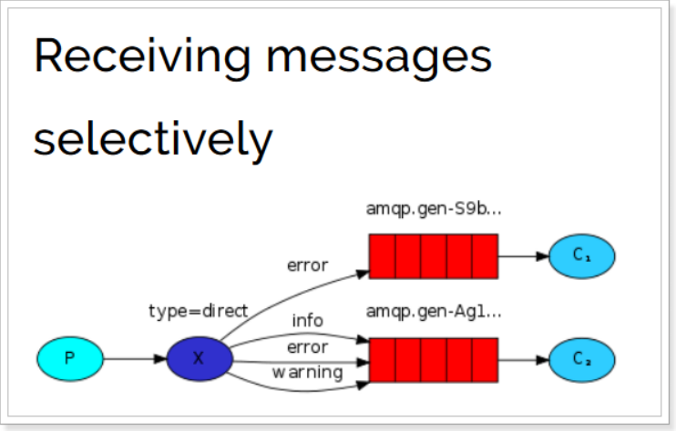

图解：

- `P`：生产者，向`Exchange`发送消息，发送消息时，会指定一个`Routing Key`。
- `X`：`Exchange`(交换机)，接收生产者的消息，然后把消息递交给与`routing key`完全匹配的队列。
- `C1`：消费者，其所在队列指定了需要 `routing key`为 `error`的消息。
- `C2`：消费者，其所在队列指定了需要 `routing key`为 `info`、`error`、`warning`的消息。

### 3.4.2、Binding 绑定

在发布与订阅模式中，我们已经创建了绑定。代码如下：

```java
@Bean
public Binding bindingA(FanoutExchange exchange, Queue queueA) {
    return BindingBuilder.bind(queueA).to(exchange);
}
```

**绑定（binding）是指交换器（exchange）和队列（queue）的关系。可以简单理解为：这个队列（queue）对这个交换器（exchange）的消息感兴趣。**
绑定可以使用一个额外的参数 `routingKey`。我们将交换器和队列传入到 `BindingBuilder`，并将 `routingKey` 绑定到交换器，如下所示：

```java
@Bean
public Binding bindingA(FanoutExchange exchange, Queue queueA) {
    return BindingBuilder.bind(queueA).to(exchange).with("error");
}
```

> `routingKey` 含义取决于交换类型。比如我们之前使用的 `fanout exchange`，会忽略它的值。

### 3.4.3、多重绑定


此外，**使用相同的绑定键绑定多个队列是完全合法的**。在我们的示例中，我们可以在 X 和 Q1 之间添加绑定键 black。在这种情况下，direct 类型的交换器将消息广播到所有匹配的队列 Q1 和 Q2。

### 3.4.4、代码整合

交换机与队列绑定图解：


#### 3.4.4.1、生产者

```java
/**
 * 生产者
 * @author Jjcc
 * @version 1.0.0
 * @className RoutingProducer.java
 * @createTime 2020年02月23日 20:29:00
 */
@Component
public class RoutingProducer {

    private RabbitTemplate template;

    private DirectExchange exchange;

    private String[] keys = {"error", "info", "warning"};

    private AtomicLong index = new AtomicLong();

    private AtomicLong count = new AtomicLong();

    @Autowired
    public RoutingProducer(RabbitTemplate template, DirectExchange directExchange) {
        this.template = template;
        this.exchange = directExchange;
    }


    @Async
    public void send() {
        StringBuilder builder = new StringBuilder("Hello to ");

        if (index.incrementAndGet() == 3) {
            this.index.set(0);
        }
        String key = keys[(int) index.get()];
        builder.append(key).append(' ').append(this.count.incrementAndGet());
        String message = builder.toString();

        template.convertAndSend(exchange.getName(), key, message);
        System.out.println(" [x] Sent '" + message + "'");
    }

}
```

#### 3.4.4.2、消费者

```java
/**
 * 消费端
 * @author Jjcc
 * @version 1.0.0
 * @className RoutingConsumer.java
 * @createTime 2020年02月23日 20:29:00
 */
@Component
public class RoutingConsumer {

    @RabbitListener(queues = "#{queueA.name}")
    public void receiver1(String message) {
        receiver(1, message);
    }

    @RabbitListener(queues = "#{queueB.name}")
    public void receiver2(String message) {
        receiver(2, message);
    }

    private void receiver(int instance, String message) {
        System.out.println("instance " + instance + " [x] Received '" + message + "'");
    }
}
```

#### 3.4.4.3、配置类

```java
/**
 * 消息配置类
 * @author Jjcc
 * @version 1.0.0
 * @className rabbitRoutingPatternConfig.java
 * @createTime 2020年02月23日 20:27:00
 */
@Configuration
public class RabbitRoutingPatternConfig {

    /**
     * direct 类型的交换机。
     * @title directExchange
     * @author Jjcc
     * @return org.springframework.amqp.core.DirectExchange
     * @createTime 2020/2/23 0023 20:45
     */
    @Bean
    public DirectExchange directExchange() {
        return new DirectExchange("tut.direct", true, false);
    }

    /**
     * 队列A
     * @title queueA
     * @author Jjcc
     * @return org.springframework.amqp.core.Queue
     * @createTime 2020/2/23 0023 20:47
     */
    @Bean
    public Queue queueA() {
        return new Queue("queueA", true, false, false);
    }

    /**
     * 队列B
     * @title queueB
     * @author Jjcc
     * @return org.springframework.amqp.core.Queue
     * @createTime 2020/2/23 0023 20:47
     */
    @Bean
    public Queue queueB() {
        return new Queue("queueB", true, false, false);
    }

    /**
     * 交换机与队列A绑定，指定路由为error的binding。
     * @title bindingQaError
     * @author Jjcc
     * @param directExchange 交换机
     * @param queueA 队列A
     * @return org.springframework.amqp.core.Binding
     * @createTime 2020/2/23 0023 20:57
     */
    @Bean
    public Binding bindingQaError(DirectExchange directExchange, Queue queueA) {
        return BindingBuilder.bind(queueA).to(directExchange).with("error");
    }

    /**
     * 交换机与队列B绑定，指定路由为info的binding。
     * @title bindingQaError
     * @author Jjcc
     * @param directExchange 交换机
     * @param queueB 队列B
     * @return org.springframework.amqp.core.Binding
     * @createTime 2020/2/23 0023 20:57
     */
    @Bean
    public Binding bindingQbInfo(DirectExchange directExchange, Queue queueB) {
        return BindingBuilder.bind(queueB).to(directExchange).with("info");
    }

    /**
     * 交换机与队列B绑定，指定路由为error的binding。
     * @title bindingQbError
     * @author Jjcc
     * @param directExchange 交换机
     * @param queueB 队列B
     * @return org.springframework.amqp.core.Binding
     * @createTime 2020/2/23 0023 20:57
     */
    @Bean
    public Binding bindingQbError(DirectExchange directExchange, Queue queueB) {
        return BindingBuilder.bind(queueB).to(directExchange).with("error");
    }

    /**
     * 交换机与队列B绑定，指定路由为warning的binding。
     * @title bindingQbWarning
     * @author Jjcc
     * @param directExchange 交换机
     * @param queueB 队列B
     * @return org.springframework.amqp.core.Binding
     * @createTime 2020/2/23 0023 20:57
     */
    @Bean
    public Binding bindingQbWarning(DirectExchange directExchange, Queue queueB) {
        return BindingBuilder.bind(queueB).to(directExchange).with("warning");
    }

}
```

#### 3.4.4.4、测试

```java
/**
 * @author Jjcc
 * @version 1.0.0
 * @className RoutingPatternTest.java
 * @createTime 2020年02月24日 12:56:00
 */
@RunWith(SpringRunner.class)
@SpringBootTest(classes = RabbitmqBasicDemoApplication.class)
public class RoutingPatternTest {

    @Autowired
    private RoutingProducer producer;

    @Test
    public void test() throws InterruptedException {
        for (int i = 0; i < 10; i++) {
            producer.send();
        }

        new CountDownLatch(1).await();
    }
}
```

**输出：**

```
[x] Sent 'Hello to warning 8'
[x] Sent 'Hello to error 9'
[x] Sent 'Hello to warning 2'
[x] Sent 'Hello to info 10'
[x] Sent 'Hello to info 4'
[x] Sent 'Hello to warning 5'
[x] Sent 'Hello to info 1'
[x] Sent 'Hello to info 7'
[x] Sent 'Hello to error 3'
[x] Sent 'Hello to error 6'
instance 1 [x] Received 'Hello to error 9'
instance 2 [x] Received 'Hello to warning 8'
instance 1 [x] Received 'Hello to error 3'
instance 2 [x] Received 'Hello to error 9'
instance 1 [x] Received 'Hello to error 6'
instance 2 [x] Received 'Hello to info 10'
instance 2 [x] Received 'Hello to warning 2'
instance 2 [x] Received 'Hello to info 4'
instance 2 [x] Received 'Hello to warning 5'
instance 2 [x] Received 'Hello to info 1'
instance 2 [x] Received 'Hello to info 7'
instance 2 [x] Received 'Hello to error 3'
instance 2 [x] Received 'Hello to error 6'
```

> 可以看到，队列A和队列B都接收到了 `routing key` 为 `error`的消息。
>

启动所有消费者，然后使用生产者发送消息；在消费者对应的控制台可以查看到生产者发送对应`routing key`对应队列的消息；到达按照需要接收的效果。
在执行完测试代码后，其实到`RabbitMQ`的管理后台找到 `Exchanges` 选项卡，点击  `tut.direct` 的交换机，可以查看到如下的绑定：

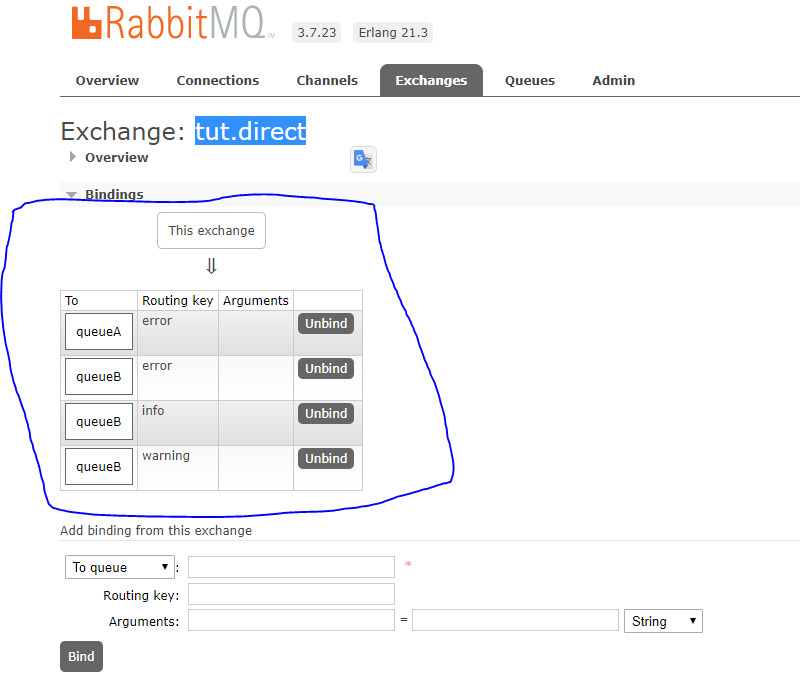

### 3.4.5、小结

Routing模式要求队列在绑定交换机时要指定 `routing key`，消息发送时指定 `routing key`，消息会转发到符合`routing key`的队列。

## 3.5、Topic 主题模式

### 3.5.1、模式说明

**`Direct Exchange`路由规则，是完全匹配 `binding key` 与`routing key`**，但这种严格的匹配方式在很多情况下不能满足实际业务需求。

`topic exchange` 与 `direct exchange`类似，也是讲消息路由到 `binding key`与 `routing key`相匹配的 `Queue`中，但这里的匹配规则不同：

- `routing key` 为一个句点号**` .`**分隔的字符串（我们将被句点号`.` 分隔开的每一段独立的字符串称为一个单词），如 “stock.usd.nyse”、”nyse.vmw”、”quick.orange.rabbit”。
- `binding key` 与 `routing key` 一样也是句点号`.` 分隔的字符串。
- `binding key` 中可以存在两种特殊字符 `*` 与`#`，用于做模糊匹配，**其中 `*` 用于匹配一个单词，`#`用于匹配多个单词（可以是零个）**。

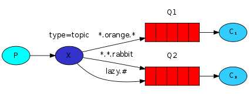

这个例子里，我们发送的所有消息都是用来描述小动物的。发送的消息所携带的路由键是由三个单词所组成的，这三个单词被两个。分割开。路由键里的第一个单词描述的是动物的速度，第二个单词是动物的颜色，第三个是动物的种类。所以它看起来是这样的：” 速度。颜色。种类”。

我们创建了三个绑定：Q1 的 binding key 为”*.orange.*“，Q2 的 binding key 为”*.*.rabbit” 和”lazy.#”。

这三个 binding key 被可以总结为：

- Q1 对所有的桔黄色动物都感兴趣。
- Q2 则是对所有的兔子和所有懒惰的动物感兴趣。

以上图中的配置为例:
`routingKey=”quick.orange.rabbit”` 的消息会同时路由到 Q1 与 Q2

`routingKey=”lazy.orange.fox”` 的消息会路由到 Q1 与 Q2

`routingKey=”lazy.brown.fox”` 的消息会路由到 Q2

`routingKey=”lazy.pink.rabbit”` 的消息会路由到 Q2（**只会投递给 Q2 一次，虽然这个 routingKey 与 Q2 的两个 bindingKey 都匹配**）

`routingKey=”quick.brown.fox”、routingKey=”orange”、routingKey=”quick.orange.male.rabbit”` 的消息将会被丢弃，因为它们没有匹配任何 bindingKey

**如果我们违反约定，发送了一个 routing key 为一个单词或者四个单词（`”orange” or “quick.orange.male.rabbit”`）的消息时，该消息不会投递给任何一个队列，而且会丢失掉。**

**但是，即使”`lazy.orange.male.rabbit`” 有四个单词，他还是会匹配最后一个绑定，并且被投递到第二个队列中。**

> **topic exchange**
>
> `topic exchange` 是强大的，它可以表现出跟其他 `exchange` 类似的行为。
>
> **当一个队列的 binding key 为 “`#`”（井号） 的时候，它会接收所有消息，而不考虑 routing key，就像 `fanout exchange`**。
>
> **当 `*` (星号) 和 `#` (井号) 这两个特殊字符都未在绑定键中出现的时候，此时 topic exchange 会表现得像 `direct exchange` 一样**。

### 3.5.2、代码整合

#### 3.5.2.1、生产者

```java
@Component
public class TopicProducer {

    private RabbitTemplate template;

    private TopicExchange exchange;

    private AtomicLong index = new AtomicLong();

    private AtomicLong count = new AtomicLong();

    private final String[] KEYS = {"quick.orange.rabbit",
            "lazy.orange.elephant", "quick.orange.fox",
            "lazy.brown.fox", "lazy.pink.rabbit", "quick.brown.fox"};

    @Autowired
    public TopicProducer(RabbitTemplate template, TopicExchange exchange) {
        this.template = template;
        this.exchange = exchange;
    }

    @Async
    public void send() {
        StringBuilder builder = new StringBuilder("Hello to ");

        if (index.incrementAndGet() == KEYS.length) {
            index.set(0);
        }

        String key = KEYS[(int) this.index.get()];
        builder.append(key).append(' ');
        builder.append(this.count.incrementAndGet());
        String message = builder.toString();

        template.convertAndSend(exchange.getName(), key, message);

        System.out.println(" [x] Sent '" + message + "'");
    }
}
```

#### 3.5.2.2、消费者

```java
@Component
public class TopicConsumer {

    @RabbitListener(queues = "#{queueTopicA.name}")
    public void receiver1(String message) {
        receiver("queueTopicA", message);
    }

    @RabbitListener(queues = "#{queueTopicB.name}")
    public void receiver2(String message) {
        receiver("queueTopicB", message);
    }

    private void receiver(String instance, String message) {
        System.out.println("队列名称： " + instance + " [x] Received '" + message + "'");
    }

}
```

#### 3.5.2.3、配置类

```java
@Configuration
public class RabbitTopicPatternConfig {

    /**
     * 创建 Topic Exchange
     * @title topicExchange
     * @author Jjcc
     * @return org.springframework.amqp.core.TopicExchange
     * @createTime 2020/2/25 0025 17:00
     */
    @Bean
    public TopicExchange topicExchange() {
        return new TopicExchange("tut.topic", true, false);
    }

    /**
     * 队列A
     * @title queueTopicA
     * @author Jjcc
     * @return org.springframework.amqp.core.Queue
     * @createTime 2020/2/25 0025 17:02
     */
    @Bean
    public Queue queueTopicA() {
        return new Queue("queue_topic_a", true, false, false);
    }

    /**
     * 对类B
     * @title queueTopicB
     * @author Jjcc
     * @return org.springframework.amqp.core.Queue
     * @createTime 2020/2/25 0025 17:03
     */
    @Bean
    public Queue queueTopicB() {
        return new Queue("queue_topic_b", true, false, false);
    }

    /**
     * 队列A与交换机绑定，指定路由键为 *.orange.* （通配符）
     * @title bindingTopicA
     * @author Jjcc
     * @param exchange 交换机
     * @param queueTopicA 队列A
     * @return org.springframework.amqp.core.Binding
     * @createTime 2020/2/25 0025 17:06
     */
    @Bean
    public Binding bindingTopicA(TopicExchange exchange, Queue queueTopicA) {
        return BindingBuilder.bind(queueTopicA).to(exchange).with("*.orange.*");
    }

    /**
     * 队列B与交换机绑定，指定路由键为 *.*.rabbit （通配符）
     * @title bindingTopicB
     * @author Jjcc
     * @param exchange 交换机
     * @param queueTopicB 队列B
     * @return org.springframework.amqp.core.Binding
     * @createTime 2020/2/25 0025 17:08
     */
    @Bean
    public Binding bindingTopicB(TopicExchange exchange, Queue queueTopicB) {
        return BindingBuilder.bind(queueTopicB).to(exchange).with("*.*.rabbit");
    }

    /**
     * 队列B与交换机绑定，指定路由键为 lazy.# （通配符）
     * @title bindingTopicC
     * @author Jjcc
     * @param exchange 交换机
     * @param queueTopicB 队列B
     * @return org.springframework.amqp.core.Binding
     * @createTime 2020/2/25 0025 17:08
     */
    @Bean
    public Binding bindingTopicC(TopicExchange exchange, Queue queueTopicB) {
        return BindingBuilder.bind(queueTopicB).to(exchange).with("lazy.#");
    }


}
```

#### 3.5.2.4、测试

```java
@RunWith(SpringRunner.class)
@SpringBootTest(classes = RabbitmqBasicDemoApplication.class)
public class TopicPatternTest {

    @Autowired
    private TopicProducer producer;

    @Test
    public void test() throws InterruptedException {
        for (int i = 0; i < 10; i++) {
            producer.send();
        }

        new CountDownLatch(1).await();
    }
}
```

**输出：**

```
[x] Sent 'Hello to lazy.orange.elephant 1'
[x] Sent 'Hello to lazy.brown.fox 9'
[x] Sent 'Hello to lazy.pink.rabbit 10'
[x] Sent 'Hello to quick.orange.fox 2'
[x] Sent 'Hello to lazy.pink.rabbit 4'
[x] Sent 'Hello to quick.orange.fox 8'
[x] Sent 'Hello to lazy.brown.fox 3'
[x] Sent 'Hello to quick.brown.fox 5'
[x] Sent 'Hello to quick.orange.rabbit 6'
[x] Sent 'Hello to lazy.orange.elephant 7'
队列名称： queueTopicB [x] Received 'Hello to lazy.orange.elephant 1'
队列名称： queueTopicA [x] Received 'Hello to lazy.orange.elephant 1'
队列名称： queueTopicA [x] Received 'Hello to quick.orange.fox 2'
队列名称： queueTopicB [x] Received 'Hello to lazy.pink.rabbit 4'
队列名称： queueTopicA [x] Received 'Hello to quick.orange.fox 8'
队列名称： queueTopicB [x] Received 'Hello to lazy.brown.fox 3'
队列名称： queueTopicA [x] Received 'Hello to quick.orange.rabbit 6'
队列名称： queueTopicB [x] Received 'Hello to quick.orange.rabbit 6'
队列名称： queueTopicA [x] Received 'Hello to lazy.orange.elephant 7'
队列名称： queueTopicB [x] Received 'Hello to lazy.orange.elephant 7'
队列名称： queueTopicB [x] Received 'Hello to lazy.brown.fox 9'
队列名称： queueTopicB [x] Received 'Hello to lazy.pink.rabbit 10'

```

> 可以看到，消息发送指定路由键为`lazy.orange.elephant`、`quick.orange.rabbit`的消息，监听队列A和监听队列B的消费者都接收到了消息。像路由键 `quick.brown.fox`并不存在的，消息并没有转发到对应的队列中，交换机选择对丢弃改消息。

启动所有消费者，然后使用生产者发送消息；在消费者对应的控制台可以查看到生产者发送对应`routing key`对应队列的消息；到达按照需要接收的效果；并且**这些`routing key`可以使用通配符**。

在执行完测试代码后，其实到RabbitMQ的管理后台找到 Exchanges 选项卡，点击  topic_exchange 的交换机，可
以查看到如下的绑定：


### 3.5.3、小结

`Topic`模式可以实现 `publish/subscribe`发布与订阅模式和 `routing`路由模式；只是`Topic`在配置 `routing key`的时候可以使用通配符（通过 `*`、`#`实现模糊匹配），显得更加灵活。

## 3.6、Headers 参数模式

Headers Exchange 不依赖于 routing key 与 binding key 的匹配规则来路由消息，而是根据发送的消息内容中的 headers 属性进行匹配。

- 在绑定 Queue 与 Exchange 时指定一组 headers 键值对。
- 当消息发送到 Exchange 时，RabbitMQ 会取到该消息的 headers（也是一个键值对的形式），对比其中的键值对是否完全匹配 Queue 与 Exchange 绑定时指定的键值对；如果完全匹配则消息会路由到该 Queue ，否则不会路由到该 Queue 。

http://www.iocoder.cn/Spring-Boot/RabbitMQ/

## 3.7、RPC 远程过程调用

RPC是指远程过程调用，也就是说两台服务器A，B，一个应用部署在A服务器上，想要调用B服务器上应用提供的函数/方法，由于不在一个内存空间，不能直接调用，需要通过网络来表达调用的语义和传达调用的数据。

为什么RPC呢？就是无法在一个进程内，甚至一个计算机内通过本地调用的方式完成的需求，比如不同的系统间的通讯，甚至不同的组织间的通讯。由于计算能力需要横向扩展，需要在多台机器组成的集群上部署应用，

RPC的协议有很多，比如最早的CORBA，Java RMI，Web Service的RPC风格，Hessian，Thrift，甚至Rest API。

https://windmt.com/2018/04/13/rabbitmq-6-rpc/

http://www.iocoder.cn/Spring-Boot/RabbitMQ/

http://www.iocoder.cn/RabbitMQ/RPC-implementation/?self

## 3.8、注解方式实现 RabbitMQ

https://blog.csdn.net/pqsas_com/article/details/79817340

https://blog.csdn.net/qq331709114/article/details/88319598

https://blog.csdn.net/u012129558/article/details/85099861

**三个注解：**

1. @EnableRabbit：开启基于注解的RabbitMQ模式
2. @RabbitListener：监听获取消息队列中的消息
3. @RabbitHandler：@RabbitListener 和 @RabbitHandler结合使用，不同类型的消息使用不同的方法来处理。

`@RabbitListener`注解指定目标方法来作为消费消息的方法，通过注解参数指定所监听的队列或者Binding。使用@RabbitListener可以设置一个自己明确默认值的`RabbitListenerContainerFactory`对象。

代码示例：

```java
/**
 * 消费端
 * @author Jjcc
 * @version 1.0.0
 * @className RabbitConsumer.java
 * @createTime 2020年02月26日 13:43:00
 */
@Component
@Log4j2
public class RabbitConsumer {

    /**
     * 支持自动声明绑定，声明之后自动监听队列的队列，此时@RabbitListener注解的queue和bindings不能同时指定，否则报错
     * @title receiver
     * @author Jjcc
     * @param message 消息。
     * @return void
     * @createTime 2020/2/26 0026 15:08
     */
    @RabbitListener(bindings = {@QueueBinding(value = @Queue(name = "queue_batch_a", durable = "true"),
            exchange = @Exchange(value = "exchange_batch_a", type = ExchangeTypes.TOPIC), key = "rabbitmq.batch.demo")})
    public void receiver(String message) {
        log.info("[消息接收者：][消息主题：]{}" + message);
    }
}
```

> 注意，`@RabbitListener`注解如果使用 `bingdings`  参数并且是添加在类上面，会抛出异常。
>
> 注意，通过添加 `@Exchange`、`@Queue`、`@QueueBinding` 注解，如果未声明 `declare="false"` 时，会**自动创建对应**的 Exchange、Queue、Binding 。

## 3.9、模式总结

RabbitMQ工作模式：

1. **简单模式 HelloWorld**

   一个生产者、一个消费者，不需要设置交换机（使用默认的交换机）。

2. **工作队列模式 Work Queue**

   一个生产者、多个消费者（消费者之间有竞争关系），不需要设置交换机（使用默认的交换机）。

3. **发布与订阅模式 publish/subscribe**

   需要设置 `fanout`类型的交换机，并且交换机和队列进行绑定，当消息发送到交换机后，交换机会将消息发送到所有与之绑定的队列。

4. **路由模式 Routing**

   需要设置 `direct`类型的交换机，交换机和队列进行绑定，并且指定 `routing key`，当发送消息到交换机后，交换机会根据发送消息时设置的 `routing key`以完全配对的方式将消息发送到对应的队列。

5. **主题模式 topic**

   需要设置 `topic`类型的交换机，交换机和队列进行绑定，并且制定通配符方式的 `routing key`（`#` 多个或0个单词、`*`一个单词），当发送消息到交换机后，交换机会根据发送消息时设置的 `routing key`以模糊匹配的方式将消息发送到对应的队列。另外主题模式也可以实现 发布与订阅模式以及路由模式。

6. **参数效验模式 Headers**

   Headers Exchange 不依赖于 routing key 与 binding key 的匹配规则来路由消息，而是根据发送的消息内容中的 headers 属性进行匹配。

# 4、批量发送消息

在一些业务场景下，我们希望使用 Producer 批量发送消息，提高发送性能。不同于我们在[《芋道 Spring Boot 消息队列 RocketMQ 入门》](http://www.iocoder.cn/Spring-Boot/RocketMQ/?self) 的[「4. 批量发送消息」](http://www.iocoder.cn/Spring-Boot/RabbitMQ/#) 功能，`RocketMQ` 是提供了一个可以批量发送多条消息的 API 。而 **Spring-AMQP 提供的批量发送消息，它提供了一个 [MessageBatch](https://github.com/spring-projects/spring-amqp/blob/master/spring-rabbit/src/main/java/org/springframework/amqp/rabbit/batch/MessageBatch.java) 消息收集器，将发送给相同 `Exchange + RoutingKey` 的消息们，“偷偷”收集在一起，当满足条件时候，一次性批量发送提交给 `RabbitMQ Broker**` 。

Spring-AMQP 通过 [BatchingRabbitTemplate](https://github.com/spring-projects/spring-amqp/blob/master/spring-rabbit/src/main/java/org/springframework/amqp/rabbit/core/BatchingRabbitTemplate.java) 提供批量发送消息的功能。如下是三个条件，满足**任一**即会批量发送：

-  【数量】`batchSize`：超过收集的消息数量的最大条数。
- 【空间】`bufferlimit`：超过收集的消息占用的最大内存。
- 【超时】`timeout`：超过收集的时间的最大等待时长，单位：毫秒。😈 不过要注意，这里的超时开始计时的时间，是**以最后一次发送时间为起点**。也就说，每调用一次发送消息，都以当前时刻开始计时，重新到达 `timeout` 毫秒才算超时。

> 另外，BatchingRabbitTemplate 提供的批量发送消息的能力**比较弱**。对于同一个 BatchingRabbitTemplate 对象来说，**同一时刻只能有一个批次(保证 Exchange + RoutingKey 相同)**，否则会报错。

## 4.1、应用依赖、应用配置文件

与 前文一致。

## 4.2、配置类

```java
/**
 * 配置类;
 * 这里没有创建 exchange、queue、bindings。而是在接收端通过@RabbitListener()注解创建的。
 * @author Jjcc
 * @version 1.0.0
 * @className RabbitConfig.java
 * @createTime 2020年02月26日 13:42:00
 */
@Configuration
public class RabbitConfig {
    
    /**
     * 创建 BatchingRabbitTemplate Bean 对象。消息批量发送需要用到此对象。
     * BatchingRabbitTemplate类是RabbitTemplate的子类。
     * @title batchingRabbitTemplate
     * @author Jjcc
     * @param connectionFactory rabbitmq连接工厂对象
     * @return org.springframework.amqp.rabbit.core.BatchingRabbitTemplate
     * @createTime 2020/2/26 0026 14:23
     */
    @Bean(value = "batchingRabbitTemplate")
    public BatchingRabbitTemplate batchingRabbitTemplate(ConnectionFactory connectionFactory) {
        /*创建 batchingStrategy 对象，代表批量策略*/
        // 超过消息数量的最大条数
        int batchSize = 16384;
        // 每次批量发送消息的最大内存
        int bufferLimit = 33554432;
        // 超过收集的时间的最大等待时间；单位毫秒
        int timeout = 1000 * 30;
        SimpleBatchingStrategy simpleBatchingStrategy = new SimpleBatchingStrategy(batchSize, bufferLimit, timeout);

        // 创建定时器对象
        ConcurrentTaskScheduler concurrentTaskScheduler = new ConcurrentTaskScheduler();

        // 创建 BatchingRabbitTemplate 对象
        BatchingRabbitTemplate batchingRabbitTemplate = new BatchingRabbitTemplate(simpleBatchingStrategy, concurrentTaskScheduler);
        batchingRabbitTemplate.setConnectionFactory(connectionFactory);
        return batchingRabbitTemplate;
    }
}
```

- `#batchingRabbitTemplate(ConnectionFactory factory)`：创建 `BatchingRabbitTemplate`Bean 对象。
  - 具体的 `batchSize`、`bufferLimit`、`timeout` 数值配置多少，根据自己的应用来。这里，我们故意将 `timeout` 配置成了 30 秒，主要为了演示之用。
  - `BatchingRabbitTemplate`对象创建需要一个批量策略对象 `simpleBatchingStrategy`，一个定时任务对象 `ConcurrentTaskScheduler`。

## 4.3、生产者

```java
/**
 * @author Jjcc
 * @version 1.0.0
 * @className RabbitProducer.java
 * @createTime 2020年02月26日 14:24:00
 */
@Component
public class RabbitProducer {

    private BatchingRabbitTemplate batchingRabbitTemplateemplate;

    private RabbitTemplate rabbitTemplate;


    @Autowired
    public RabbitProducer(BatchingRabbitTemplate template, RabbitTemplate rabbitTemplate) {
        this.batchingRabbitTemplateemplate = template;
        this.rabbitTemplate = rabbitTemplate;
    }


    private AtomicLong count = new AtomicLong();

    /**
     * 发送消息；消息批量发送需要使用 BatchingRabbitTemplate对象。
     * @title send
     * @author Jjcc
     * @return void
     * @createTime 2020/2/26 0026 14:30
     */
    @Async
    public void send() {
        String s = "Hello World!!!：" + count.incrementAndGet();
        batchingRabbitTemplateemplate.convertAndSend("exchange_batch_a", "rabbitmq.batch.demo", s);
    }
}
```

- 这里换成了 使用 `BatchingRabbitTemplate`对象发送消息，其它都是与前文一致的。`BatchingRabbitTemplate`是`RabbitTemplate`的子类，它额外实现了 **偷偷**”收集消息来实现批量发送。

## 4.4、消费者

```java
/**
 * 消费端
 * @author Jjcc
 * @version 1.0.0
 * @className RabbitConsumer.java
 * @createTime 2020年02月26日 13:43:00
 */
@Component
@Log4j2
public class RabbitConsumer {

    /**
     * 支持自动声明绑定，声明之后自动监听队列的队列，此时@RabbitListener注解的queue和bindings不能同时指定，否则报错
     * @title receiver
     * @author Jjcc
     * @param message 消息。
     * @return void
     * @createTime 2020/2/26 0026 15:08
     */
    @RabbitListener(bindings = {@QueueBinding(value = @Queue(name = "queue_batch_a", durable = "true"),
            exchange = @Exchange(value = "exchange_batch_a", type = ExchangeTypes.TOPIC), key = "rabbitmq.batch.demo")})
    public void receiver(String message) {
        log.info("[消息接收者：][消息主题：]{}" + message);
    }
}
```

- 这里是使用注解 `@RabbitListener`一个 `binding`，应用启动时，`amqp`中会扫描所有 `@RabbitListener`的方法或类，从而在 `rabbitmq broken` 里创建 `exchange`、`queue`、`binding`。

## 4.5、测试

编写单元测试方法，测试 Producer 批量发送消息的效果。代码如下：

```
@SpringBootTest(classes = RabbitmqBatchDemoApplication.class)
@RunWith(SpringRunner.class)
public class RabbitmqBatchDemoApplicationTests {

    @Autowired
    private RabbitProducer producer;

    @Test
    public void contextLoads() throws InterruptedException {
        for (int i = 0; i < 10; i++) {
            producer.send();
        }
        System.out.println("消息发送完成！！！！！！！！！");
        new CountDownLatch(1).await();
    }

}
```

**执行 `#contextLoads()`方法，测试批量发送消息。控制台输出如下：**

```
2020-02-26 15:03:28.568  INFO 13468 --- [           main] o.s.s.concurrent.ThreadPoolTaskExecutor  : Initializing ExecutorService 'applicationTaskExecutor'
消息发送完成！！！！！！！！！
2020-02-26 15:03:58.601  INFO 13468 --- [ntContainer#0-1] com.jjcc.batch.consumer.RabbitConsumer   : [消息接收者：][消息主题：]{}Hello World!!!：7
2020-02-26 15:03:58.603  INFO 13468 --- [ntContainer#0-1] com.jjcc.batch.consumer.RabbitConsumer   : [消息接收者：][消息主题：]{}Hello World!!!：8
2020-02-26 15:03:58.603  INFO 13468 --- [ntContainer#0-1] com.jjcc.batch.consumer.RabbitConsumer   : [消息接收者：][消息主题：]{}Hello World!!!：9
2020-02-26 15:03:58.603  INFO 13468 --- [ntContainer#0-1] com.jjcc.batch.consumer.RabbitConsumer   : [消息接收者：][消息主题：]{}Hello World!!!：10
2020-02-26 15:03:58.603  INFO 13468 --- [ntContainer#0-1] com.jjcc.batch.consumer.RabbitConsumer   : [消息接收者：][消息主题：]{}Hello World!!!：5
2020-02-26 15:03:58.604  INFO 13468 --- [ntContainer#0-1] com.jjcc.batch.consumer.RabbitConsumer   : [消息接收者：][消息主题：]{}Hello World!!!：2
2020-02-26 15:03:58.604  INFO 13468 --- [ntContainer#0-1] com.jjcc.batch.consumer.RabbitConsumer   : [消息接收者：][消息主题：]{}Hello World!!!：6
2020-02-26 15:03:58.604  INFO 13468 --- [ntContainer#0-1] com.jjcc.batch.consumer.RabbitConsumer   : [消息接收者：][消息主题：]{}Hello World!!!：1
2020-02-26 15:03:58.604  INFO 13468 --- [ntContainer#0-1] com.jjcc.batch.consumer.RabbitConsumer   : [消息接收者：][消息主题：]{}Hello World!!!：3
2020-02-26 15:03:58.604  INFO 13468 --- [ntContainer#0-1] com.jjcc.batch.consumer.RabbitConsumer   : [消息接收者：][消息主题：]{}Hello World!!!：4

Process finished with exit code -1

```

- 因为使用 `BatchingRabbitTemplate`批量发送消息，所以在 producer 发送完消息后，consumer 并未接收到消息。而是在 producer 发送完最后一条消息后开始计时，触发了 `timeout`条件。Consumer 才消费到批量发送的 10 条消息。

# 5、批量消费消息

`RabbitMQ Broker` 存储的是**一条**消息。又或者说，**RabbitMQ 并没有提供`批量接收消息`的 API 接口**。

那么，为什么我们在**批量发送消息 示例**能够实现呢？答案是批量发送消息是 `Spring-AMQP` 的 [SimpleBatchingStrategy](https://github.com/spring-projects/spring-amqp/blob/master/spring-rabbit/src/main/java/org/springframework/amqp/rabbit/batch/SimpleBatchingStrategy.java) 所封装提供：

- 在 `Producer` 最终批量发送消息时，`SimpleBatchingStrategy` 会通过 [`#assembleMessage()`](https://github.com/spring-projects/spring-amqp/blob/master/spring-rabbit/src/main/java/org/springframework/amqp/rabbit/batch/SimpleBatchingStrategy.java#L141-L156) 方法，**将批量发送的多条消息组装成一条“批量”消息**，然后进行发送。
- 在 `Consumer` 拉取到消息时，会根据[`#canDebatch(MessageProperties properties)`](https://github.com/spring-projects/spring-amqp/blob/master/spring-rabbit/src/main/java/org/springframework/amqp/rabbit/batch/SimpleBatchingStrategy.java#L158-L163) 方法，判断该消息是否为一条“批量”消息？如果是，则调用[`# deBatch(Message message, Consumer fragmentConsumer)`](https://github.com/spring-projects/spring-amqp/blob/master/spring-rabbit/src/main/java/org/springframework/amqp/rabbit/batch/SimpleBatchingStrategy.java#L165-L194) 方法，将一条“批量”消息**拆开**，变成**多条**消息。

> 在一些业务场景下，我们希望使用 Consumer 批量消费消息，提高消费速度。在 Spring-AMQP 中，**提供了两种批量消费消息的方式。**

## 5.1、监听容器工厂方式

在 `SimpleBatchingStrategy` 将一条“批量”消息拆开，变成多条消息后，直接**批量**交给 Consumer 进行消费处理。

`copy`一份批量发送消息项目。

### 5.1.1、配置类

修改 [RabbitConfig](https://github.com/YunaiV/SpringBoot-Labs/blob/master/lab-04/lab-04-rabbitmq-demo-batch-consume/src/main/java/cn/iocoder/springboot/lab04/rabbitmqdemo/config/RabbitConfig.java) 配置类，添加自定义的 [SimpleRabbitListenerContainerFactory](https://github.com/spring-projects/spring-amqp/blob/master/spring-rabbit/src/main/java/org/springframework/amqp/rabbit/config/SimpleRabbitListenerContainerFactory.java) Bean ，支持用于创建**支持批量消费**的 [SimpleRabbitListenerContainer](https://github.com/spring-projects/spring-amqp/blob/master/spring-rabbit/src/main/java/org/springframework/amqp/rabbit/listener/SimpleMessageListenerContainer.java) 。代码如下：

```java
	/**
     * 创建一个消息侦听器容器。
     * 用于管理 RabbitMQ监听器listener 的容器工厂；这里设置成支持批量消费。
     * @title simpleRabbitListenerContainerFactory
     * @author Jjcc
     * @param configurer  未知的参数
     * @param connectionFactory rabbitmq连接工厂对象
     * @return org.springframework.amqp.rabbit.config.SimpleRabbitListenerContainerFactory
     * @createTime 2020/2/26 0026 22:08
     */
    @Bean("simpleRabbitListenerContainerFactory")
    public SimpleRabbitListenerContainerFactory simpleRabbitListenerContainerFactory(
            SimpleRabbitListenerContainerFactoryConfigurer configurer, ConnectionFactory connectionFactory) {
        // 创建 SimpleRabbitListenerContainerFactory 对象
        SimpleRabbitListenerContainerFactory factory = new SimpleRabbitListenerContainerFactory();

        configurer.configure(factory, connectionFactory);

        // 设置容器是否应该对批处理消息进行反批处理(true)或调用该批处理的侦听器(false)。默认值:true。
        // 支持批量处理消息的方法随版本而有差异。
        // factory.setDeBatchingEnabled(false);
        
        // 配置消费者的监听器是批量消费消息的类型。
    	//这里 amqp 版本：2.2.1.RELEASE。2.1.X版本无此方法。
        factort.setBatchListener(true);

        return factory;
    }
```

- 在 [RabbitAnnotationDrivenConfiguration](https://github.com/spring-projects/spring-boot/blob/master/spring-boot-project/spring-boot-autoconfigure/src/main/java/org/springframework/boot/autoconfigure/amqp/RabbitAnnotationDrivenConfiguration.java) 自动化配置类中，它会默认创建一个名字为 `"rabbitListenerContainerFactory"` 的 `SimpleRabbitListenerContainerFactory` Bean ，可用于消费者的监听器是**单个**消费的。
- 我们自定义创建的一个名字为`"consumerBatchContainerFactory"` 的 `SimpleRabbitListenerContainerFactory` Bean ，可用于消费者的监听器是**批量**消费的。重点是 `factort.setBatchListener(true)` 处，配置消费者的监听器是**批量**消费消息的类型。

### 5.1.2、消费端

修改消费端，代码如下：

```java
/**
 * 消费端
 * @author Jjcc
 * @version 1.0.0
 * @className RabbitConsumer.java
 * @createTime 2020年02月26日 13:43:00
 */
@Component
@Log4j2
public class RabbitConsumer {

    /**
     * 支持自动声明绑定，声明之后自动监听队列的队列，此时@RabbitListener注解的queue和bindings不能同时指定，否则报错
     * @title receiver
     * @author Jjcc
     * @param message 消息。
     * @return void
     * @createTime 2020/2/26 0026 15:08
     */
    @RabbitListener(bindings = {@QueueBinding(value = @Queue(name = "queue_batch_a", durable = "true"),
            exchange = @Exchange(value = "exchange_batch_a", type = ExchangeTypes.TOPIC), key = "rabbitmq.batch.demo")}
            , containerFactory = "consumerBatchContainerFactory")
    public void receiver(List<String> message) {
        int size = message.size();
        log.info("[消息接收者：][消息数量：]{}",size);
    }
}
```

- 在类上的 `@@RabbitListener` 注解的 `containerFactory` 属性，设置了在 `RabbitConfig`创建的 `SimpleRabbitListenerContainerFactory` Bean ，表示它要批量消费消息。
- 在 `#receiver(...)` 消费方法上，修改方法入参的类型为 List 数组。

### 5.1.3、测试

```java
@SpringBootTest(classes = RabbitmqBatchDemoApplication.class)
@RunWith(SpringRunner.class)
public class RabbitmqBatchDemoApplicationTests {

    @Autowired
    private RabbitProducer producer;

    @Test
    public void contextLoads() throws InterruptedException {
        for (int i = 0; i < 10; i++) {
            producer.send();
        }
        System.out.println("消息发送完成！！！！！！！！！");
        new CountDownLatch(1).await();
    }

}
```

**执行后，控制台输出如下：**

```
2020-02-26 22:43:14.146  INFO 7324 --- [           main] o.s.s.concurrent.ThreadPoolTaskExecutor  : Initializing ExecutorService 'applicationTaskExecutor'
消息发送完成！！！！！！！！！
2020-02-26 22:43:19.211  INFO 7324 --- [ntContainer#0-1] com.jjcc.batch.consumer.RabbitConsumer   : [消息接收者：][消息数量：]10

```

## 5.2、批量消费消息（第二弹）

监听容器工厂方式 依赖 批量发送消息 的功能，有点过于苛刻。所以，`Spring-AMQP` 提供了第二种批量消费消息的方式。

其实现方式是，阻塞等待最多 `receiverTimeout`秒，拉取 `batchSize`条消息，进行批量消费。

- 如果在 `receiverTimeout`秒内已经成功拉取到 `batchSize`条信息，则直接进行批量消费消息。
- 如果在 `receiverTimeout`秒还没取到 `batchSize`条数据，不再等待，而是进行批量消费消息。

不过 Spring-AMQP 的阻塞等待时长 `receiveTimeout` 的设计有点“神奇”。它代表的是，每次拉取一条消息，最多阻塞等待 `receiveTimeout` 时长。如果等待不到下一条消息，则进入已获取到的消息的批量消费。😈 也就是说，极端情况下，可能等待 `receiveTimeout * batchSize` 时长，才会进行批量消费（**每拉取一条消息，都会刷新 `receiverTimeout` 的时间**）。

### 5.2.1、依赖、配置文件

依赖、配置文件**与监听容器工厂方式**一致。

### 5.2.2、配置类

添加自定义的 [SimpleRabbitListenerContainerFactory](https://github.com/spring-projects/spring-amqp/blob/master/spring-rabbit/src/main/java/org/springframework/amqp/rabbit/config/SimpleRabbitListenerContainerFactory.java) Bean ，支持用于创建**支持批量消费**的 [SimpleRabbitListenerContainer](https://github.com/spring-projects/spring-amqp/blob/master/spring-rabbit/src/main/java/org/springframework/amqp/rabbit/listener/SimpleMessageListenerContainer.java) 。代码如下：

```java
/**
 * 配置类;
 * 这里没有创建 exchange、queue、bindings。而是在接收端通过@RabbitListener()注解创建的。
 * @author Jjcc
 * @version 1.0.0
 * @className RabbitConfig.java
 * @createTime 2020年02月26日 13:42:00
 */
@Configuration
public class RabbitConfig {

 

    @Bean("simpleRabbitListenerContainerFactory")
    public SimpleRabbitListenerContainerFactory simpleRabbitListenerContainerFactory(
            SimpleRabbitListenerContainerFactoryConfigurer configurer,
            ConnectionFactory connectionFactory) {

        SimpleRabbitListenerContainerFactory factory = new SimpleRabbitListenerContainerFactory();
        configurer.configure(factory, connectionFactory);

        // 额外添加批量处理消息的属性
        factory.setBatchListener(true);
        // 拉取等待时间，每次拉取到消息都会重新等待
        factory.setReceiveTimeout(6 * 1000L);
        // 批处理的消息储量
        factory.setBatchSize(10);
        //
        factory.setConsumerBatchEnabled(true);

        return factory;
    }
}
```

- 相比 监听容器工厂方式，额外增加了 `batchSize = 10`、`receiveTimeout = 30 * 1000L`、`consumerBatchEnabled = true`上来说，**本小节才是真正意义上的批量消费消息**。


### 5.2.3、生产者

使用 `Spring-AMQP` 封装提供的 `RabbitTemplate` 而不是 **监听容器工厂** 时使用的 `BatchingRabbitTemplate`，实现发送消息。

### 5.2.4、消费者

**批量**消费消息。代码如下：

```java
@Component
@Log4j2
public class RabbitConsumer {

    /**
     * 支持自动声明绑定，声明之后自动监听队列的队列，此时@RabbitListener注解的queue和bindings不能同时指定，否则报错
     * @title receiver
     * @author Jjcc
     * @param message 消息。
     * @return void
     * @createTime 2020/2/26 0026 15:08
     */
    @RabbitListener(bindings = {@QueueBinding(value = @Queue(name = "queue_batch_a", durable = "true"),
            exchange = @Exchange(value = "exchange_batch_a", type = ExchangeTypes.TOPIC), key = "rabbitmq.batch.demo")}
            , containerFactory = "simpleRabbitListenerContainerFactory")
    public void receiver(List<String> message) {
        log.info("[消息接收者：][消息主题：]{}",message.size());
    }
}
```

### 5.2.5、测试

```java
@SpringBootTest(classes = RabbitmqBatchDemoApplication.class)
@RunWith(SpringRunner.class)
public class RabbitmqBatchDemoApplicationTests {

    @Autowired
    private RabbitProducer producer;

    @Test
    public void contextLoads01() throws InterruptedException {
        this.testSyncSend(3);
    }

    @Test
    public void contextLoads02() throws InterruptedException {
        this.testSyncSend(10);
    }

    public void testSyncSend(int n) throws InterruptedException {

        for (int i = 0; i < n; i++) {
            producer.send();
            System.out.println("消息发送完成！！！！！！！！！");
        }

        new CountDownLatch(1).await();
    }

}
```

执行 `#contextLoads01()` 方法，**超时**情况下的批量消费。控制台输出如下：

```
2020-02-27 12:28:14.103  INFO 1088 --- [           main] o.s.s.concurrent.ThreadPoolTaskExecutor  : Initializing ExecutorService 'applicationTaskExecutor'
消息发送完成！！！！！！！！！
消息发送完成！！！！！！！！！
消息发送完成！！！！！！！！！
2020-02-27 12:28:20.161  INFO 1088 --- [ntContainer#0-1] com.jjcc.batch.consumer.RabbitConsumer   : [消息接收者：][消息主题：]3

```

符合预期，消息只有3条，没有达到 `BatchSize`的条件，只能等待超时。

执行 `#contextLoads02()` 方法，**未超时**情况下的批量消费。控制台输出如下：

```
2020-02-27 12:30:01.971  INFO 15112 --- [           main] o.s.s.concurrent.ThreadPoolTaskExecutor  : Initializing ExecutorService 'applicationTaskExecutor'
消息发送完成！！！！！！！！！
消息发送完成！！！！！！！！！
消息发送完成！！！！！！！！！
消息发送完成！！！！！！！！！
消息发送完成！！！！！！！！！
消息发送完成！！！！！！！！！
消息发送完成！！！！！！！！！
消息发送完成！！！！！！！！！
消息发送完成！！！！！！！！！
消息发送完成！！！！！！！！！
2020-02-27 12:30:02.019  INFO 15112 --- [ntContainer#0-1] com.jjcc.batch.consumer.RabbitConsumer   : [消息接收者：][消息主题：]10

```

符合预期，消息10条，达到了 `BatchSize`条件，消费端直接拉取消息。

# 6、消费重试

[《RabbitMQ 之死信队列》](http://www.iocoder.cn/RabbitMQ/dead-letter-queue/?self)

**在消息消费失败的时候，Spring-AMQP 会通过消息重试机制，重新投递消息给 Consumer，让 `Consumer`有机会重新消费消息，实现消费成功**。

当然，**`Spring-AMQP` 并不会无限重新投递消息给 Consumer 重新消费，而是在默认情况下，达到 N 次重试次数时，Consumer 还是消费失败时，该消息就会进入到死信队列**。后续，我们可以通过对死信队列中的消息进行重发，来使得消费者实例再次进行消费。

- 消费重试是由 Spring-AMQP 所封装提供的，死信队列是 RabbitMQ 自带的功能。

> 那么消费失败到达最大次数的消息，是怎么进入到死信队列的呢？Spring-AMQP 在消息到达最大消费次数的时候，会将该消息进行否定(`basic.nack`)，并且 `requeue=false` ，这样后续就可以利用 RabbitMQ 的[死信队列](https://www.rabbitmq.com/dlx.html)的机制，将该消息转发到死信队列。
>
> 另外，每条消息的失败重试，是可以配置一定的**间隔时间**。

## 6.1、依赖

与前文应用一致。

## 6.2、配置文件

创建 [`application.yaml`](https://github.com/YunaiV/SpringBoot-Labs/blob/master/lab-04/lab-04-rabbitmq-consume-retry/src/main/resources/application.yaml) 配置文件。配置如下：

```yml
spring:
  rabbitmq:
    username: guest
    password: guest
    host: localhost
    port: 5672
    listener:
      simple:
        # 对应 RabbitProperties.ListenerRetry 类
        retry:
          enabled: true               # 开启消费重试机制,默认为 false。
          max-attempts: 3             # 最大重试次数，默认3次。包括了初始次数。
          initial-interval: 1000      # 重试间隔，默认1000毫秒。
          multiplier: 1.0             # 递乘的时间间隔
```

- **新增** `spring.rabbitmq.simple.retry.enable=true` 配置项，来开启 Spring-AMQP 的消费重试的功能，默认为 `false`。同时，通过**新增** `max-attempts` 和 `initial-interval` 配置项，设置重试次数和间隔。`spring.rabbitmq.listener.simple.retry.multiplier`配置项表示每次重试间隔随着重试次数而递乘（第一次重试：multiplier * 1、第二次重试：multiplier * 2，以此类推）。
  - `max-attempts` 配置项要注意，是一条消息一共尝试消费总共 `max-attempts` 次，包括首次的正常消费。
-  可以通过添加 `spring.rabbitmq.listener.simple.retry.max-interval` 配置项来实现**最大**的时间间隔。

**在 Spring-AMQP 的消费重试机制中，在消费失败到达最大次数后，会自动抛出`AmqpRejectAndDontRequeueException` 异常，从而结束该消息的消费重试**。这意味着**如果我们在消费消息的逻辑中，主动抛出 `AmqpRejectAndDontRequeueException` 异常，也能结束该消息的消费重试**。Spring-AMQP 是通过我们在上文中提到的 `basic.nack` + `requeue=false` ，从而实现转发该消息到死信队列中。

默认情况下，`spring.rabbitmq.simple.retry.enable=false` ，关闭 Spring-AMQP 的消费重试功能。但是实际上，消费发生异常的消息，还是会一直**重新消费**。这是为什么呢？**Spring-AMQP 会将该消息通过 `basic.nack` + `requeue=true` ，重新投递回原队列的尾巴**。如此，我们便会不断拉取到该消息，不断“重试”消费该消息。当然在这种情况下，我们一样可以**主动**抛出 `AmqpRejectAndDontRequeueException` 异常，也能结束该消息的消费重试。Spring-AMQP 也是通过我们在上文中提到的 `basic.nack` + `requeue=false` ，从而实现转发该消息到死信队列中。

**我们再来简单说说 Spring-AMQP 是怎么提供消费重试的功能的。**

- Spring-AMQP 基于 [spring-retry](https://github.com/spring-projects/spring-retry) 项目提供的 [RetryTemplate](https://github.com/spring-projects/spring-retry/blob/master/src/main/java/org/springframework/retry/support/RetryTemplate.java) ，实现重试功能。Spring-AMQP 在获取到消息时，会交给 RetryTemplate 来调用消费者 Consumer 的监听器 Listener(就是我们实现的)，实现该消息的**多次**消费重试。
- 在该消息的**每次消费失败**后，RetryTemplate 会通过 [BackOffPolicy](https://github.com/spring-projects/spring-retry/blob/master/src/main/java/org/springframework/retry/backoff/BackOffPolicy.java) 来进行计算，该消息的**下一次重新消费的时间**，通过 `Thread#sleep(...)` 方法，实现重新消费的时间间隔。到达时间间隔后，RetryTemplate 又会调用消费者 Consumer 的监听器 Listener 来消费该消息。
- 当该消息的重试消费到达**上限**后，RetryTemplate 会调用 [MethodInvocationRecoverer](https://github.com/spring-projects/spring-retry/blob/master/src/main/java/org/springframework/retry/interceptor/MethodInvocationRecoverer.java) 回调来实现恢复。而 Spring-AMQP 自定义实现了 [RejectAndDontRequeueRecoverer](https://github.com/spring-projects/spring-amqp/blob/master/spring-rabbit/src/main/java/org/springframework/amqp/rabbit/retry/RejectAndDontRequeueRecoverer.java) 来**自动**抛出 `AmqpRejectAndDontRequeueException` 异常，从而结束该消息的消费重试。😈 结束的方式，Spring-AMQP 是通过我们在上文中提到的 `basic.nack` + `requeue=false` ，从而实现转发该消息到死信队列中。
- 有一点需要注意，**Spring-AMQP 提供的消费重试的计数是客户端级别的，重启 JVM 应用后，计数是会丢失的**。所以，如果想要计数进行持久化，需要自己重新实现下。

## 6.3、配置类

创建 [RabbitConfig](https://github.com/YunaiV/SpringBoot-Labs/tree/master/lab-04/lab-04-rabbitmq-consume-retry/src/main/java/cn/iocoder/springboot/lab04/rabbitmqdemo/config/RabbitConfig.java) 配置类，额外添加**死信队列**的配置。代码如下：

```java
@Configuration
public class RabbitConfig {

    /**
     * deadLetterExchange()：进入死信队列的交换机
     * deadLetterRotingKey()：进入死信队列的路由键
     * @title commonQueue
     * @author Jjcc
     * @return org.springframework.amqp.core.Queue
     * @createTime 2020/2/27 0027 21:53
     */
    @Bean
    public Queue commonQueue() {
        return QueueBuilder.durable("retry_queue")
                .deadLetterExchange("exchange_dead_a")
                .deadLetterRoutingKey("dead.routing.key").build();
    }
    
    /**
     * 死信队列
     * @title deadQueue
     * @author Jjcc 
     * @return org.springframework.amqp.core.Queue
     * @createTime 2020/2/27 0027 21:55
     */
    @Bean
    public Queue deadQueue() {
        return new Queue("dead_queue_a", true, false, false);
    }
    
    /**
     * topic类型的交换机
     * @title topicExchange
     * @author Jjcc 
     * @return org.springframework.amqp.core.TopicExchange
     * @createTime 2020/2/27 0027 21:55
     */
    @Bean
    public TopicExchange topicExchange() {
        return new TopicExchange("exchange_dead_a", true, false);
    }
    
    /**
     * 普通消息队列与交换机的绑定
     * @title commonBinding
     * @author Jjcc 
     * @param topicExchange 交换机对象
     * @param commonQueue 普通队列对象
     * @return org.springframework.amqp.core.Binding
     * @createTime 2020/2/27 0027 21:55
     */
    @Bean
    public Binding commonBinding(TopicExchange topicExchange, Queue commonQueue) {
        return BindingBuilder.bind(commonQueue).to(topicExchange).with("rabbitmq.batch.demo");
    }

    /**
     * 死信队列与交换机的绑定
     * @title deadQueueBinding
     * @author Jjcc
     * @param topicExchange 交换机对象
     * @param deadQueue 死信队列对象
     * @return org.springframework.amqp.core.Binding
     * @createTime 2020/2/27 0027 21:56
     */
    @Bean
    public Binding deadQueueBinding(TopicExchange topicExchange, Queue deadQueue) {
        return BindingBuilder.bind(deadQueue).to(topicExchange).with("dead.routing.key");
    }
}
```

- 创建的正常 `Queue` 额外设置了，当消息成为死信时，RabbitMQ 自动转发到 Exchange 为 `exchange_dead_a`，RoutingKey 为 `dead.routing.key` 的死信队列中。
- 通过 `#deadQueue()` 方法来创建死信队列的 Queue ，通过 `#deadQueueBinding()` 方法来创建死信队列的 Binding 。😈 因为我们重用了 Exchange 为 `exchange_dead_a` ，所以无需创建。

## 6.4、生产者

使用 Spring-AMQP 封装提供的 RabbitTemplate ，实现发送消息。与前文项目一致。

```java
@Component
public class RabbitProducer {

    private RabbitTemplate rabbitTemplate;


    @Autowired
    public RabbitProducer(RabbitTemplate rabbitTemplate) {
        this.rabbitTemplate = rabbitTemplate;
    }


    private AtomicLong count = new AtomicLong();

    /**
     * 发送消息；消息批量发送需要使用 BatchingRabbitTemplate对象。
     * @title send
     * @author Jjcc
     * @return void
     * @createTime 2020/2/26 0026 14:30
     */
    @Async
    public void send() {
        String s = "Hello World!!!：" + count.incrementAndGet();
        rabbitTemplate.convertAndSend("exchange_dead_a", "rabbitmq.batch.demo", s);
    }
}
```

## 6.5、消费者

```java
@Component
@Log4j2
public class RabbitConsumer {

    /**
     * @title receiver
     * @author Jjcc
     * @param message 消息。
     * @return void
     * @createTime 2020/2/26 0026 15:08
     */
    @RabbitListener(queues = "retry_queue")
    public void receiver(String message) {
        log.info("[消息接收者：][消息主题：]{}" + message);

        // <X> 注意，此处抛出一个 RuntimeException 异常，模拟消费失败
        throw new RuntimeException("我就是故意抛出一个异常");
    }
}
```

- 在 `X` 处，我们在消费消息时候，抛出一个 RuntimeException 异常，模拟消费失败。

## 6.6、死信队列 消费者

```java
@Component
@Log4j2
public class DeadRabbitConsumer {

//    @RabbitListener(bindings = {
//            @QueueBinding(value = @Queue(name = "dead_queue_a", durable = "true"),
//                    exchange = @Exchange(value = "exchange_dead_a1"), key = "dead.routing.key")})
    @RabbitListener(queues = "dead_queue_a")
    public void deadReceiver(String message) {
        log.info("[onMessage][【死信队列】线程编号:{} 消息内容：{}]", Thread.currentThread().getId(), message);
    }
}
```

## 6.7、测试

```java
@SpringBootTest(classes = RabbitmqBatchDemoApplication.class)
@RunWith(SpringRunner.class)
public class RabbitmqBatchDemoApplicationTests {

    @Autowired
    private RabbitProducer producer;

    @Test
    public void contextLoads() throws InterruptedException {
        for (int i = 0; i < 1; i++) {
            producer.send();
        }
        System.out.println("消息发送完成！！！！！！！！！");
        new CountDownLatch(1).await();
    }

}
```

控制台输出如下：

```
# Producer 成功同步发送了 1 条消息
2019-12-15 14:21:40.424  INFO 66569 --- [           main] c.i.s.l.r.producer.Demo07ProducerTest    : [testSyncSend][发送编号：[1576045300] 发送成功]

# Demo07Consumer 第 1 次消费
2019-12-15 14:21:40.442  INFO 66569 --- [ntContainer#0-1] c.i.s.l.r.consumer.Demo07Consumer        : [onMessage][线程编号:17 消息内容：Demo07Message{id=1576045300}]
# 一秒后，Consumer 第 2 次消费
2019-12-15 14:21:41.446  INFO 66569 --- [ntContainer#0-1] c.i.s.l.r.consumer.Demo07Consumer        : [onMessage][线程编号:17 消息内容：Demo07Message{id=1576045300}]
# 一秒后，Consumer 第 3 次消费
2019-12-15 14:21:42.450  INFO 66569 --- [ntContainer#0-1] c.i.s.l.r.consumer.Demo07Consumer        : [onMessage][线程编号:17 消息内容：Demo07Message{id=1576045300}]

# RejectAndDontRequeueRecoverer 打印该消息消费重试到达上限，同时打印异常堆栈
2019-12-15 14:21:42.457  WARN 66569 --- [ntContainer#0-1] o.s.a.r.r.RejectAndDontRequeueRecoverer  : Retries exhausted for message (Body:'[B@514e3b1c(byte[187])' MessageProperties [headers={}, contentType=application/x-java-serialized-object, contentLength=0, receivedDeliveryMode=PERSISTENT, priority=0, redelivered=false, receivedExchange=EXCHANGE_DEMO_07, receivedRoutingKey=ROUTING_KEY_07, deliveryTag=1, consumerTag=amq.ctag-UpkeXbl-7TYRNt_LuYDZJQ, consumerQueue=QUEUE_DEMO_07])
// ... 省略一大堆异常堆栈

# Demo07DeadConsumer 消费死信队列的该条消息
2019-12-15 14:21:42.463  INFO 66569 --- [ntContainer#1-1] c.i.s.l.r.consumer.Demo07DeadConsumer    : [onMessage][【死信队列】线程编号:19 消息内容：Demo07Message{id=1576045300}]

```

- Consumer 重试消费消息 3 次，每次间隔 1 秒，全部都失败，最终该消息转发到死信队列中。
- DeadConsumer 消费死信队列中的该消息。

# 7、延时队列/延迟消息

在 **消息重试** 中，Spring-AMQP 基于 RabbitMQ提供的 **死信队列**，通过 `basic.nack + requeue=false`的方式，将重试消息达到上限次数的消息，投递到死信队列中。

**延迟消息** 我们还是基于 RabbitMQ 的**死信队列**，实现**定时消息**的功能。RabbitMQ 提供了过期时间 [TTL](https://www.rabbitmq.com/ttl.html) 机制，可以设置消息在队列中的存活时长。在消息到达过期时间时，会从当前队列中删除，并被 RabbitMQ 自动转发到对应的死信队列中。

> `RabbitMQ队列`本身是没有直接实现支持延迟队列的功能，但可以通过它的[Time-To-Live Extensions](https://www.rabbitmq.com/ttl.html) 与 [Dead Letter Exchange](http://www.rabbitmq.com/dlx.html) 的特性模拟出延迟队列的功能。

## 7.1、TTL

**`TTL`全称 `Time-To-Live` 存活时间**，**RabbitMQ支持为队列或消息设置 TTL**，`TTL`表明了一条消息可在队列中存活的最大时间。当某条消息设置了 TTL或者当某条消息进入了设置`TTL`的队列时，这条消息会在TTL时间后**死亡成为 Dead Letter 死信**。

> 如果既配置了消息的TTL，又配置了队列的TTL，那么较小的那个值会被取用。

## 7.2、延迟消息

**延迟消息就是指当消息被发送以后，并不想让消费者立即拿到消息，而是等待指定的时间后，消费者才能拿到这个消息进行消费**。

## 7.3、延迟队列

### 7.3.1、延迟队列认识

延迟队列又称为 **死信队列/延时队列**；也是队列的一种，只不过与普通的队列最大的不同之处在于创建时的组成成分不同，**创建死信队列的“成分”将不仅仅只是：名称、持久化、自动删除等基本属性，还包含了死信交换机、死信路由甚至还有TTL（Time-To-Live）即队列中消息可生存的时间**。

**死信队列其实最大的作用是可以实现消息或者数据延迟/延时处理，而且还可以动态的设定延迟的时间，即动态设定 TTL**。

> 凡是业务中需要延迟一定时间再处理的数据均可以将其放入死信队列中，等待一定的时间后再执行真正的处理逻辑。

### 7.3.2、延迟队列能做什么？

- **订单业务：** 在电商/点餐中，都有下单后 30 分钟内没有付款，就自动取消订单。
- **短信通知：** 下单成功后 60s 之后给用户发送短信通知。
- **失败重试：** 业务操作失败后，间隔一定的时间进行失败重试。

这类业务的特点就是：非实时的，需要延迟处理，需要进行失败重试。一种比较笨的方式是采用定时任务，轮训数据库，方法简单好用，但性能底下，在高并发情况下容易弄死数据库，间隔时间不好设置，时间过大，影响精度，过小影响性能，而且做不到按超时的时间顺序处理。另一种就是用**Java中的DelayQueue 位于java.util.concurrent包下，本质是由PriorityQueue和BlockingQueue实现的阻塞优先级队列。**，这玩意最大的问题就是**不支持分布式与持久化**

## 7.4、延迟消息 结构

下面是死信队列在创建、绑定、生产消息、消费消息过程的结构流程图，在这里其实已经很明确的指出死信队列的创建跟绑定逻辑 以及 真正监听消费处理消息的队列的绑定逻辑。

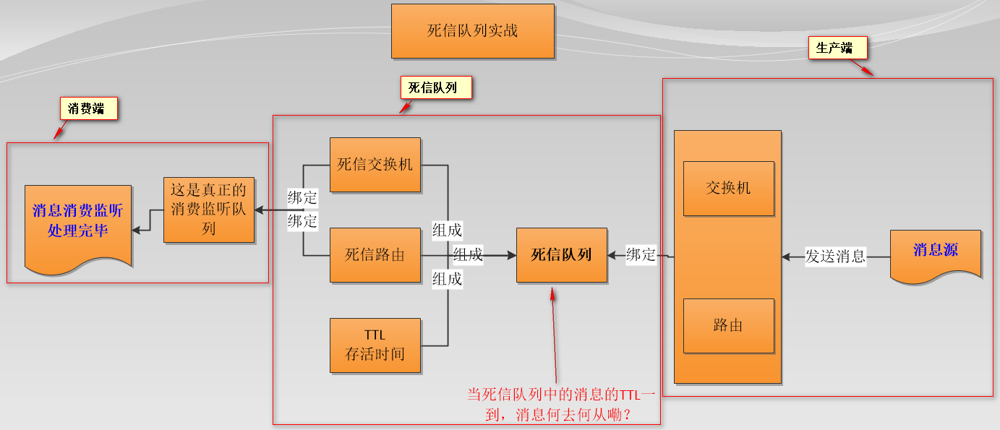

图中问题的答案为：**当入死信队列的消息TTL一到，它自然而然的将被路由到  `死信交换机绑定的队列 `中被真正消费处理！！！**

**死信队列场景实战**

有了上面的流程图做指导，接下来，我们将用死信队列实战这样的一个业务场景：用户在商城下单成功并点击去支付后在指定时间未支付时自动失效！

于是乎，我们需要创建两个消息模型，在 RabbitmqConfig 实施：

- 死信队列：用于设定指定的待支付的交易订单号在指定的 TTL（单位为 ms）后何去何从！
- 真正队列：用于监听消费处理指定的交易订单号，即判断该交易订单号是否已完成，如果否，则失效之！

## 7.5、基于**TTL**的延时队列 代码示例

### 7.5.1、依赖、配置文件

与前文项目一致

### 7.5.2、配置类

创建 [RabbitConfig](https://github.com/YunaiV/SpringBoot-Labs/blob/master/lab-04/lab-04-rabbitmq-demo-delay/src/main/java/cn/iocoder/springboot/lab04/rabbitmqdemo/config/RabbitConfig.java) 配置类，额外添加**延迟队列**（死信队列）的配置。代码如下：

```java
/**
 * 配置类;
 * @author Jjcc
 * @version 1.0.0
 * @className RabbitConfig.java
 * @createTime 2020年02月26日 13:42:00
 */
@Configuration
public class RabbitConfig {

    /**
     * Queue
     * ttl()：设置队列的消息存活时间。
     * deadLetterExchange()：进入死信队列的交换机
     * deadLetterRotingKey()：进入死信队列的路由键
     * @title commonQueue
     * @author Jjcc
     * @return org.springframework.amqp.core.Queue
     * @createTime 2020/2/27 0027 21:53
     */
    @Bean
    public Queue commonQueue() {
        return QueueBuilder.durable("common_queue_a")
                .ttl(1000 * 10)
                .deadLetterExchange("exchange_delay_a")
                .deadLetterRoutingKey("delay.routing.key").build();
    }

    /**
     * 延迟队列
     * @title deadQueue
     * @author Jjcc
     * @return org.springframework.amqp.core.Queue
     * @createTime 2020/2/27 0027 21:55
     */
    @Bean
    public Queue delayQueue() {
        return new Queue("delay_queue_a", true, false, false);
    }

    /**
     * topic类型的交换机
     * @title topicExchange
     * @author Jjcc
     * @return org.springframework.amqp.core.TopicExchange
     * @createTime 2020/2/27 0027 21:55
     */
    @Bean
    public TopicExchange topicExchange() {
        return new TopicExchange("exchange_delay_a", true, false);
    }

    /**
     * 普通消息队列与交换机的绑定
     * @title commonBinding
     * @author Jjcc
     * @param topicExchange 交换机对象
     * @param commonQueue 普通队列对象
     * @return org.springframework.amqp.core.Binding
     * @createTime 2020/2/27 0027 21:55
     */
    @Bean
    public Binding commonBinding(TopicExchange topicExchange, Queue commonQueue) {
        return BindingBuilder.bind(commonQueue).to(topicExchange).with("rabbitmq.common.demo");
    }

    /**
     * 延迟队列与交换机的绑定
     * @title deadQueueBinding
     * @author Jjcc
     * @param topicExchange 交换机对象
     * @param delayQueue 延迟队列对象
     * @return org.springframework.amqp.core.Binding
     * @createTime 2020/2/27 0027 21:56
     */
    @Bean
    public Binding deadQueueBinding(TopicExchange topicExchange, Queue delayQueue) {
        return BindingBuilder.bind(delayQueue).to(topicExchange).with("delay.routing.key");
    }
}
```

- 相比于 **消费重试** 中，在`#commonQueue()`方法中创建了的队列，额外设置了该队列的消息的过期时间。默认时间为 `10s`。

### 7.5.3、生产者

使用 Spring-AMQP 封装提供的 RabbitTemplate ，实现发送消息。代码如下：

```java
@Component
@Log4j2
public class RabbitProducer {

    private RabbitTemplate rabbitTemplate;

    @Autowired
    public RabbitProducer(RabbitTemplate rabbitTemplate) {
        this.rabbitTemplate = rabbitTemplate;
    }

    private AtomicLong count = new AtomicLong();

    /**
     * 发送消息时，相比于前面的生产者，这里额外添加了一个 org.springframework.amqp.core.MessagePostProcessor 参数。
     * MessagePostProcessor 是一个接口，提供一个 postProcessMessage()方法，可以通过该方法指定该条消息的存活时间。
     * @title send
     * @author Jjcc
     * @param delay 消息过期时间
     * @return void
     * @createTime 2020/2/28 0028 17:36
     */
    @Async
    public void send(Integer delay) {
        String s = "Hello World!!!：" + count.incrementAndGet();
        rabbitTemplate.convertAndSend("exchange_delay_a", "rabbitmq.common.demo", s, (message) -> {

            Optional<Integer> delayOpt = Optional.ofNullable(delay);

            // 如果 delay 参数不为空，则设置消息的存活时间。
            delayOpt.ifPresent( c -> {
                if (0 != c) {
                    message.getMessageProperties().setExpiration(String.valueOf(delay));
                }
            });
            return message;
        });
        log.info("消息发送完成！！！！！！！！！");
    }
}
```

- 调用 `#send(Integer id, Integer delay)` 方法来发送消息时，如果传递了方法参数 `delay` ，则我们会设置消息的 TTL 过期时间。

### 7.5.4、消费者

消费**延迟队列**（死信队列）的消息。代码如下：

```java
/**
 * 延迟消息 消费端
 * @author Jjcc
 * @version 1.0.0
 * @className DeadRabbitConsumer.java
 * @createTime 2020年02月27日 16:13:00
 */
@Component
@Log4j2
public class DelayRabbitConsumer {

    @RabbitListener(queues = "delay_queue_a")
    public void deadReceiver(String message) {
        log.info("[onMessage][【延迟消息消费端】线程编号:{} 消息内容：{}]", Thread.currentThread().getId(), message);
    }
}
```

- 在类上，添加了 [`@RabbitListener`](https://github.com/spring-projects/spring-amqp/blob/master/spring-rabbit/src/main/java/org/springframework/amqp/rabbit/annotation/RabbitListener.java) 注解，声明了消费的队列是 `"delay_queue_a"` 这个**延迟队列（死信队列）**
- 在消费逻辑中，我们正常消费该消息即可，实现自己需要的业务逻辑。

> 注意，定义的延迟队列 `common_queue_a`**不能**添加消费者（即创建一个监听 `common_queue`的消费者）。**如果延迟队列添加了消费者，当有延时消息进入延迟队列时，消息会直接被消费者直接消费，不会进入延时状态**。

### 7.5.5、测试

```java
@SpringBootTest(classes = RabbitmqBatchDemoApplication.class)
@RunWith(SpringRunner.class)
public class RabbitmqBatchDemoApplicationTests {

    @Autowired
    private RabbitProducer producer;

    @Test
    public void contextLoads() throws InterruptedException {
       sendDelay(null);
    }

    @Test
    public void contextLoadsB() throws InterruptedException {
        sendDelay(5000);
    }


    public void sendDelay(Integer delay) throws InterruptedException {
        producer.send(delay);
        System.out.println("消息发送完成！！！！！！！！！");
        new CountDownLatch(1).await();
    }

}
```

- `#contextLoads()`：不设置消息的过期时间，使用**队列的消息的过期时间**。
- `#contextLoadsB()`：设置消息的过期时间，送消息的**过期时间为 5000 毫秒**。

执行 `#contextLoads()`方法，不设置消息的过期时间，使用队列**默认的消息过期**时间。控制台输出如下：

```java
# Producer 同步发送消息成功。
2019-12-15 15:44:34.571  INFO 85481 --- [           main] c.i.s.l.r.producer.Demo08ProducerTest    : [testSyncSendDelay][发送编号：[1576050274] 发送成功]

# Consumer 10 秒后，消费到该消息
2019-12-15 15:44:44.588  INFO 85481 --- [ntContainer#0-1] c.i.s.l.r.consumer.Demo08Consumer        : [onMessage][线程编号:17 消息内容：Demo08Message{id=1576050274}]

```

执行 `#contextLoadsB()`方法，设置消息的过期时间，发送消息的**过期时间为 5000 毫秒**。控制台输出如下：

```java
# Producer 同步发送消息成功。
2019-12-15 15:45:41.076  INFO 85735 --- [           main] c.i.s.l.r.producer.Demo08ProducerTest    : [testSyncSendDelay][发送编号：[1576050341] 发送成功]

# Consumer 5 秒后，消费到该消息
2019-12-15 15:45:46.090  INFO 85735 --- [ntContainer#0-1] c.i.s.l.r.consumer.Demo08Consumer        : [onMessage][线程编号:17 消息内容：Demo08Message{id=1576050341}]
```

### 7.5.6、缺点

**同一个队列里的消息延时时间最好一致**，比如说队列里的延时时间都是1小时，千万不能队列里的消息延时时间乱七八糟多久的都有，这样的话**先入队的消息如果延时时间过长会堵着后入队延时时间小的消息，导致后面的消息到时也无法变成死信转发出去**。

有点类似于 `java concurrent`下的 `DelayQueue`队列，`DelayQueue`队列元素的出队并不与队列中元素的剩余时间有关，而是在于位于堆顶的元素有关（根据比较器决定哪个元素位于堆顶，可能根节点的剩余时间还未`<=0`，其子节点已经`<=0`了，这就导致出队线程会一直等待根节点剩余时间`<=0`；**）。

> **举个栗子：延时队列里先后进入A,B,C三条消息，存活时间是3h,2h,1h，结果到了1小时C不会死，到了2hB不会死，到了3小时A死了，同时B,C也死了，意味着3h后A,B,C才能消费；**
>
> 先进先出，排在后面的消息即使死亡，也要等待前面未死亡的消息死亡。

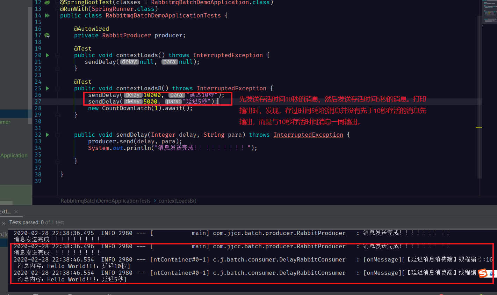

## 7.6、rabbitmq_delayed_message_exchange插件方式

`TTL`方式实现延迟队列功能，**在消息死亡时间比较灵活复杂的时候我们不可能声明很多死信队列去管理**，而且声明一个就要6个bean，**希望能够有种方式使其消息死亡异步化，到期即死即消费，不会被阻塞**，这里介绍使用插件的方式，不过需要rabbitmq要是3.6版本以上，也就是说，加入你的rabbitmq版本太老只能用TTL。

### 7.6.1、基于插件方式实现流程

这里和TTL方式有个很大的不同就是**TTL存放消息在死信队列(delayqueue)里，而基于插件存放消息在延时交换机里(x-delayed-message exchange)**。

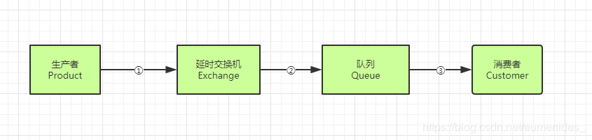

1. 生产者将消息(msg)和路由键(routekey)发送指定的延时交换机(exchange)上
2. 延时交换机(exchange)存储消息等待消息到期根据路由键(routekey)找到绑定自己的队列(queue)并把消息给它
3. 队列(queue)再把消息发送给监听它的消费者(customer）

### 7.6.1、插件安装

插件下载地址：

> http://www.rabbitmq.com/community-plugins.html

打开网址后，ctrl + f，搜索`rabbitmq_delayed_message_exchange`。
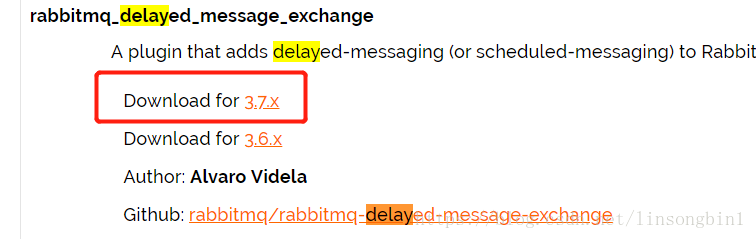

千万记住，一定选好版本号，由于我使用的是RabbitMQ 3.7.4,因此对应的`rabbitmq_delayed_message_exchange`插件也必须选择3.7.x的。

下载完插件后，将其放置到RabbitMQ安装目录下的`plugins`目录下，并使用如下命令启动这个插件：

> 先进入RabbitMQ的sbin目录 然后进入CMD。
>
> 执行名：rabbitmq-plugins enable rabbitmq_delayed_message_exchange

如果启动成功会出现如下信息：

> The following plugins have been enabled:
> rabbitmq_delayed_message_exchange

启动插件成功后，记得重启一下RabbitMQ，让其生效。

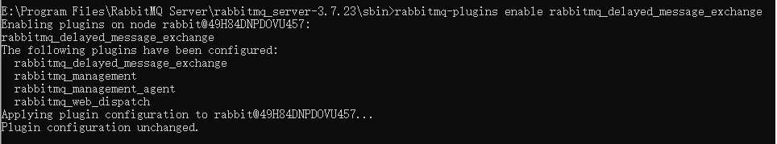


​		